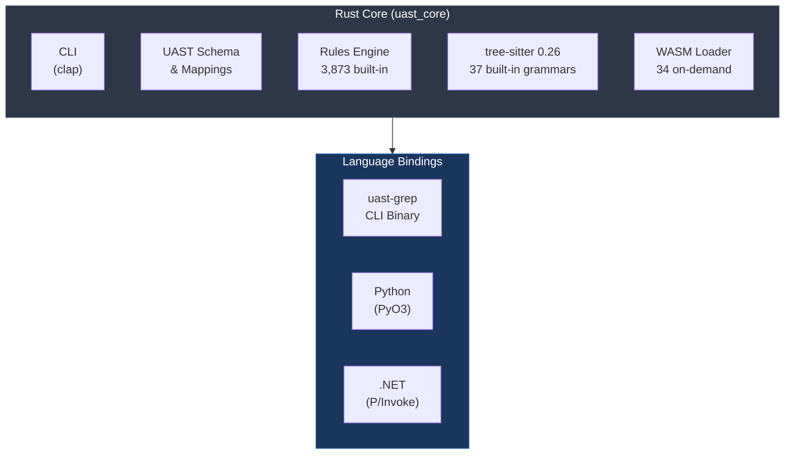

# UAST-Grep

[](https://www.rust-lang.org/)
[](https://dotnet.microsoft.com/)
[](https://variably-constant.github.io/UAST-Grep/languages/overview.html)
[](https://variably-constant.github.io/UAST-Grep/rules/rules-catalog.html)
[](LICENSE)

> **A high-performance cross-language AST search and SAST tool powered by tree-sitter**
>
> *Created by Mark Newton*

## Overview

UAST-Grep provides **blazing fast** AST-based code search and security scanning across **71 programming languages**. The pure Rust core delivers sub-millisecond startup with bindings for CLI, Python, and .NET.

### Key Features

| Feature | Description |
|---------|-------------|
| **Single Binary** | No runtime dependencies - download and run |
| **3,873 Built-in Rules** | Security, performance, and quality rules embedded in the binary |
| **71 Languages** | 37 built-in + 34 on-demand WASM grammars |
| **SARIF 2.1.0** | First-class CI/CD integration |
| **Zero Config** | Just run `uast-grep scan ./src` to find issues |
| **Cross-Language Patterns** | Write once, match across any language |

### Built-in Rules

| Ruleset | Rules | Coverage |
|---------|-------|----------|
| **Security** | 1,587 | 179 CWEs, OWASP Top 10, 31 languages |
| **Performance** | 1,334 | O(n^2) detection, memory anti-patterns |
| **Quality** | 952 | Code smells, complexity, naming |

### Performance

| Operation | Time | vs Traditional Tools |
|-----------|------|---------------------|
| Startup | 6ms | **90x faster** |
| Parse file | 16ms | **61x faster** |
| Pattern search | 34ms | **31x faster** |
| Binary size | 29MB | No dependencies |

---

## Quick Start

### Security Scanning (Zero Config)

```bash
# Scan with ALL 3,873 built-in rules
uast-grep scan ./src

# Scan with specific rulesets
uast-grep scan -r security ./src      # 1,587 security rules
uast-grep scan -r performance ./src   # 1,334 performance rules
uast-grep scan -r quality ./src       # 952 quality rules

# Output to SARIF for CI/CD
uast-grep scan -f sarif ./src > results.sarif
```

### Pattern Search

```bash
# Find all functions (cross-language pattern)
uast-grep run -p FunctionDeclaration -l rust ./src
uast-grep run -p FunctionDeclaration -l python ./src  # Same pattern!

# Native tree-sitter patterns
uast-grep run -p function_item -l rust ./src
uast-grep ts-query "(function_item name: (identifier) @name)" -l rust ./src

# List supported languages
uast-grep languages
```

### Custom Rules

```bash
# Run external rules only
uast-grep scan -e ./my-rules.yaml ./src

# Merge custom rules with built-in security rules
uast-grep scan -e ./my-rules.yaml -r security ./src
```

---

## Installation

### From GitHub Releases (Recommended)

```bash
# Windows
curl -LO https://github.com/Variably-Constant/UAST-Grep/releases/latest/download/uast-grep-windows-x64.zip
unzip uast-grep-windows-x64.zip

# Linux
curl -LO https://github.com/Variably-Constant/UAST-Grep/releases/latest/download/uast-grep-linux-x64.tar.gz
tar xzf uast-grep-linux-x64.tar.gz && chmod +x uast-grep

# macOS (Apple Silicon)
curl -LO https://github.com/Variably-Constant/UAST-Grep/releases/latest/download/uast-grep-macos-arm64.tar.gz
tar xzf uast-grep-macos-arm64.tar.gz && chmod +x uast-grep
```

No runtime dependencies required.

### From Source

```bash
git clone https://github.com/Variably-Constant/UAST-Grep.git
cd UAST-Grep/native/uast_core
cargo build --release
# Binary: target/release/uast-grep
```

### Python Package

```bash
# From source
cd UAST-Grep/python
pip install maturin
maturin develop --features python
```

### .NET Library

```bash
# From source
cd UAST-Grep
dotnet build src/UAST.Core -c Release
```

---

## Architecture



---

## CLI Reference

### Scan Command

```
uast-grep scan [OPTIONS] <FILES>...

Options:
  -r, --ruleset <RULESET>    Built-in ruleset: security, performance, quality, all, none [default: all]
  -e, --external <FILE>      Path to external YAML rules file
  -f, --format <FORMAT>      Output format: text, json, sarif [default: text]
  -s, --severity <LEVEL>     Minimum severity: hint, info, warning, error
  -c, --config <FILE>        Path to config file (UAST-Grep.yaml)
      --fix                  Apply auto-fixes
      --dry-run              Show fixes without applying
```

### Search Commands

```
uast-grep run -p <PATTERN> -l <LANG> <FILES>...    # UAST pattern search
uast-grep ts-query <QUERY> -l <LANG> <FILES>...    # Tree-sitter S-expression
uast-grep languages                                 # List supported languages
uast-grep ast -l <LANG> <FILE>                     # Dump AST
```

---

## Supported Languages

### Built-in (37) - Zero Loading Overhead

| Category | Languages |
|----------|-----------|
| **Core** | PowerShell, C# |
| **Data** | JSON, YAML, XML, TOML, CSV |
| **DevOps** | Dockerfile, HCL/Terraform, Bicep, Nix, Bash |
| **Web** | HTML, CSS, JavaScript, TypeScript, TSX, Vue, Angular |
| **Backend** | Python, Go, Java, C, C++, Rust |
| **Scripting** | Ruby, PHP, Lua |
| **Build** | CMake, Make, Protocol Buffers, GraphQL |
| **Functional** | Elixir, Erlang, Clojure, Elm |

### WASM (34) - Downloaded on First Use

| Category | Languages |
|----------|-----------|
| **Enterprise** | COBOL, Fortran, SQL, F#, Kotlin, Scala |
| **System** | Objective-C, Swift, Julia, D, Crystal, CUDA, Haskell, Perl |
| **Specialized** | Arduino, Agda, OCaml, Apex, Dart, Groovy, Common Lisp |
| **Modern** | Zig, AWK, Vim, R, Ada, Cairo, Dhall, CUE |

> WASM grammars are cached in `~/.uast/grammars/` after first download.

---

## YAML Rule Syntax

```yaml
id: sql-injection-concat
language: universal
severity: error
message: "Potential SQL injection via string concatenation"
tags: [security, cwe-89, owasp-a03]

rule:
  all:
    - pattern: "$QUERY + $INPUT"
    - pattern: "$QUERY"
      regex: "(?i)(SELECT|INSERT|UPDATE|DELETE)"

fix: "Use parameterized queries"
url: "https://cwe.mitre.org/data/definitions/89.html"
```

### Pattern Syntax

| Pattern | Meaning |
|---------|---------|
| `$NAME` | Capture single node |
| `$$NAME` | One or more nodes |
| `$$$NAME` | Zero or more nodes |
| `$_` | Anonymous capture |

See [Rule Syntax Documentation](https://variably-constant.github.io/UAST-Grep/rules/syntax.html) for complete reference.

---

## CI/CD Integration

### GitHub Actions

```yaml
name: Security Scan
on: [push, pull_request]

jobs:
  scan:
    runs-on: ubuntu-latest
    steps:
      - uses: actions/checkout@v4

      - name: Download UAST-Grep
        run: |
          curl -LO https://github.com/Variably-Constant/UAST-Grep/releases/latest/download/uast-grep-linux-x64.tar.gz
          tar xzf uast-grep-linux-x64.tar.gz
          chmod +x uast-grep

      - name: Run Security Scan
        run: ./uast-grep scan -r security -f sarif ./src > results.sarif

      - name: Upload SARIF
        uses: github/codeql-action/upload-sarif@v2
        with:
          sarif_file: results.sarif
```

### Pre-commit Hook

```yaml
# .pre-commit-config.yaml
repos:
  - repo: local
    hooks:
      - id: uast-grep
        name: Security Scan
        entry: uast-grep scan -r security
        language: system
        types: [file]
```

---

## Project Structure

```
UAST-Grep/
├── native/uast_core/        # Rust crate (PRIMARY)
│   ├── src/                  # CLI + library + FFI
│   │   ├── cli/               # CLI commands
│   │   ├── uast/              # UAST schema & mappings
│   │   ├── matching/          # Pattern engine
│   │   ├── rules/             # YAML rules engine
│   │   ├── sarif/             # SARIF 2.1.0 output
│   │   └── python.rs          # PyO3 bindings
│   └── grammars/             # 37 built-in grammars
├── src/
│   ├── UAST.Core/            # .NET rule engine with embedded rules
│   ├── UAST.Cli/             # .NET CLI (alternative to Rust)
│   └── UAST.Native/          # .NET P/Invoke bindings
├── python/                   # Python wrapper
├── rules/                    # Sample/custom YAML rules
└── docs/                     # mdBook documentation
```

---

## Configuration

### Environment Variables

| Variable | Description | Default |
|----------|-------------|---------|
| `UAST_WASM_PATH` | Custom WASM grammar directory | `~/.uast/grammars/` |
| `UAST_OFFLINE` | Disable auto-download | `0` |

### Config File

Create `UAST-Grep.yaml` in your project root:

```yaml
# Custom external rules to load
rules:
  - ./rules/team-standards.yaml

# Override built-in rule settings
ruleOverrides:
  universal-magic-number:
    severity: info
  universal-todo-comment:
    enabled: false

# File patterns to exclude
exclude:
  - "**/node_modules/**"
  - "**/vendor/**"
  - "**/*.test.js"
```

---

## Documentation

Full documentation available at **[variably-constant.github.io/UAST-Grep](https://variably-constant.github.io/UAST-Grep/)**

- [Getting Started](https://variably-constant.github.io/UAST-Grep/getting-started/installation.html)
- [Pattern Syntax](https://variably-constant.github.io/UAST-Grep/patterns/metavariables.html)
- [Rule Authoring](https://variably-constant.github.io/UAST-Grep/rules/syntax.html)
- [Security Rules (1,587)](https://variably-constant.github.io/UAST-Grep/rules/security.html)
- [Performance Rules (1,334)](https://variably-constant.github.io/UAST-Grep/rules/performance.html)
- [Quality Rules (952)](https://variably-constant.github.io/UAST-Grep/rules/quality.html)
- [CWE/OWASP Coverage](https://variably-constant.github.io/UAST-Grep/rules/cwe-owasp-coverage.html)
- [Rules Catalog](https://variably-constant.github.io/UAST-Grep/rules/rules-catalog.html)

---

## Contributing

We welcome contributions! See [CONTRIBUTING.md](CONTRIBUTING.md) for guidelines.

```bash
# Build from source
cd native/uast_core && cargo build --release

# Run tests
cargo test                              # Rust
cd python && pytest                     # Python
dotnet test tests/UAST.Core.Tests       # .NET
```

---

## License

MIT License - See [LICENSE](LICENSE) for details.

---

<div align="center">

**[Documentation](https://variably-constant.github.io/UAST-Grep/)** | **[Issues](https://github.com/Variably-Constant/UAST-Grep/issues)** | **[Releases](https://github.com/Variably-Constant/UAST-Grep/releases)**

*Created by Mark Newton*

</div>
