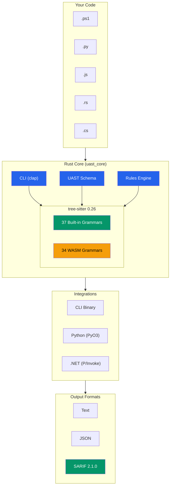
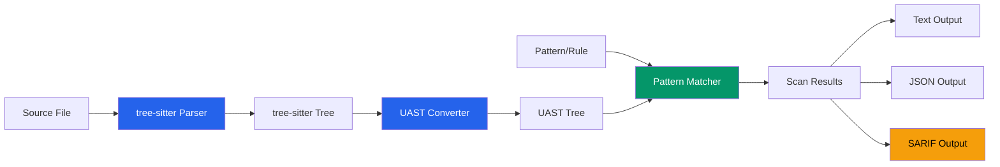

# UAST-Grep

> **A high-performance cross-language AST search tool powered by tree-sitter**
>
> *Created by Mark Newton*

## What is UAST-Grep?

UAST-Grep is a blazing-fast AST-based code search tool that works across **71 programming languages**. Unlike regex-based tools like `grep`, UAST-Grep understands your code's structure, letting you search for semantic patterns like "all function declarations" or "any try-catch block with an empty handler."

The tool is built entirely in Rust for maximum performance, with bindings for Python and .NET.

## Why Use AST Search?

Traditional text search has limitations:

```bash
# Regex can't distinguish between comments, strings, and actual code
grep -r "function" ./src  # Matches comments, strings, variable names...
```

With UAST-Grep, you search the Abstract Syntax Tree:

```bash
# Find only actual function declarations
uast-grep run -p FunctionDeclaration -l javascript ./src
```

## Key Features

| Feature | Description |
|---------|-------------|
| **71 Languages** | 37 built-in + 34 on-demand WASM grammars |
| **Cross-Language Patterns** | Write once, search any language with UAST patterns |
| **Security Scanning** | YAML rules with severity levels and auto-fix |
| **Blazing Fast** | 6ms startup, parallel scanning, Rust-powered |
| **SARIF Output** | First-class CI/CD integration |
| **Multiple Bindings** | CLI, Python (PyO3), .NET (P/Invoke) |

## Security Scanning

UAST-Grep is designed for **security scanning** across your entire codebase:

```bash
# Scan for security issues with YAML rules
uast-grep scan -r rules/security.yaml ./src

# Output as SARIF for GitHub Code Scanning
uast-grep scan -r rules/ -f sarif ./src > results.sarif

# Apply automatic fixes
uast-grep scan -r rules/security.yaml --fix ./src

# Fail CI on errors
uast-grep scan -r rules/ --fail-on-issues ./src
```

**Built-in security rule categories:**
- **Injection vulnerabilities** - `Invoke-Expression`, `eval()`, SQL injection
- **Credential exposure** - Plain-text passwords, hardcoded secrets
- **Dangerous APIs** - Unsafe deserialization, command execution
- **Code quality** - Empty catch blocks, unused variables

## Cross-Language Scanning

One of UAST-Grep's most powerful features is **cross-language security scanning**. Write a single rule that works across all 71 supported languages:

```yaml
# This rule works for Python, JavaScript, PowerShell, etc.
id: find-all-functions
language: "*"  # Universal rule!
severity: info
message: "Found function: $NAME"
rule:
  pattern: "FunctionDeclaration"
```

The UAST (Unified AST) layer normalizes node types across languages:

| UAST Type | Python | JavaScript | Rust | C# |
|-----------|--------|------------|------|-----|
| `FunctionDeclaration` | `function_definition` | `function_declaration` | `function_item` | `method_declaration` |
| `IfStatement` | `if_statement` | `if_statement` | `if_expression` | `if_statement` |
| `TryStatement` | `try_statement` | `try_statement` | - | `try_statement` |

## Performance

UAST-Grep is designed for speed:

| Operation | Time | vs .NET CLI |
|-----------|------|-------------|
| Startup | 6ms | **90x faster** |
| Parse file | 16ms | **61x faster** |
| Pattern search | 34ms | **31x faster** |
| Binary size | 29MB | No dependencies |

## Architecture

UAST-Grep uses a two-tier architecture for maximum flexibility:



### Data Flow



## Quick Example

```bash
# Find all async functions in TypeScript
uast-grep run -p FunctionDeclaration -l typescript ./src

# Find PowerShell security issues with YAML rules
uast-grep scan -r rules/security.yaml -l powershell ./scripts

# Output as SARIF for CI/CD
uast-grep scan -r rules/ -f sarif ./src > results.sarif
```

## Getting Started

Ready to try UAST-Grep? Head to the [Installation](getting-started/installation.md) guide to get started, or jump straight to the [Quick Start](getting-started/quick-start.md) for hands-on examples.

### Quick Install

```bash
# Download for your platform
curl -LO https://github.com/Variably-Constant/UAST-Grep/releases/latest/download/uast-grep-$(uname -s | tr '[:upper:]' '[:lower:]')-$(uname -m).tar.gz
tar -xzf uast-grep-*.tar.gz
./uast-grep --version
```

## License

MIT License - See [LICENSE](https://github.com/Variably-Constant/UAST-Grep/blob/main/LICENSE) for details.
