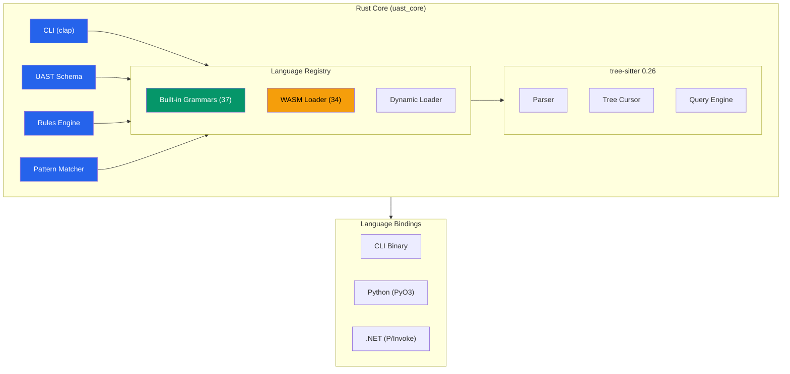
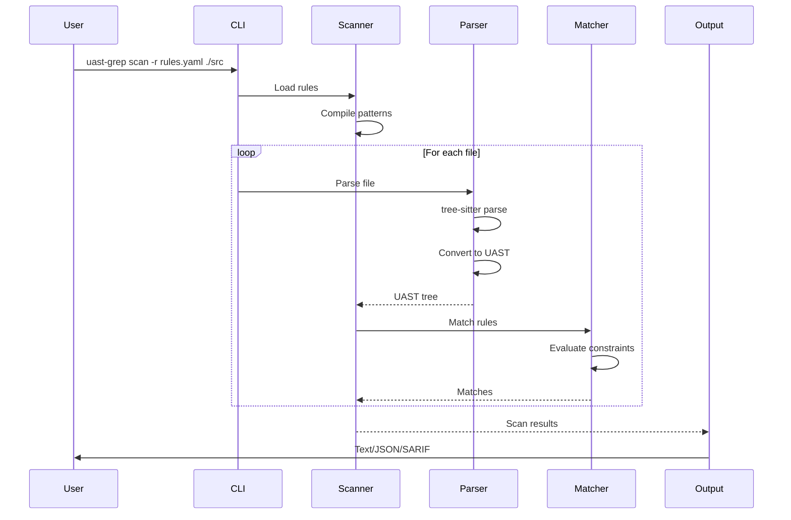
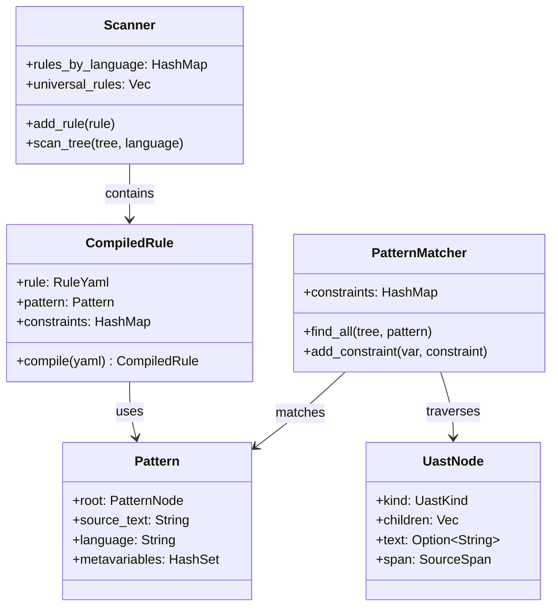
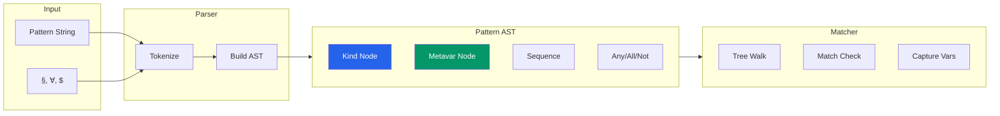
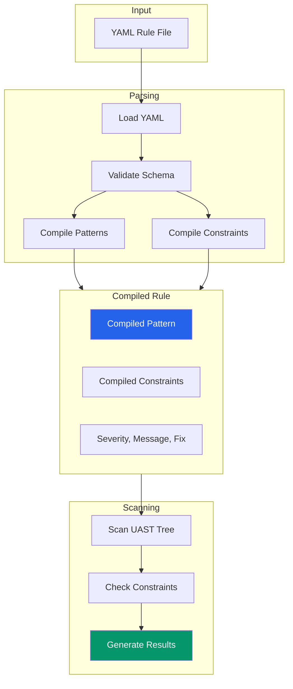
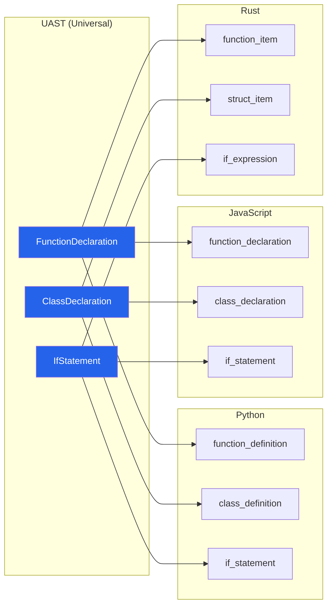
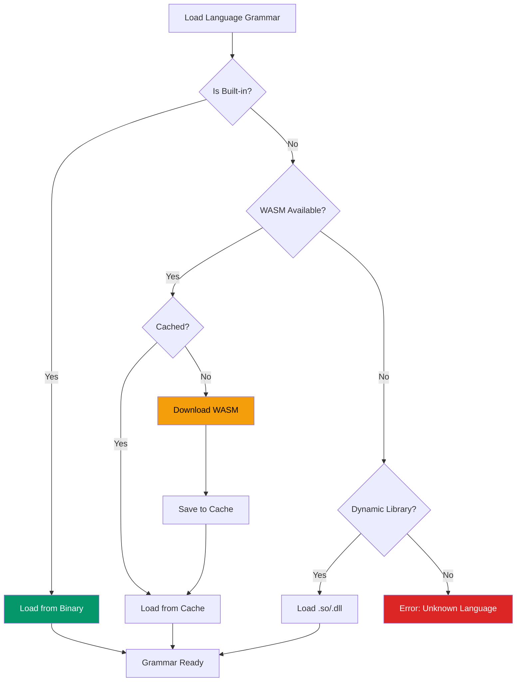
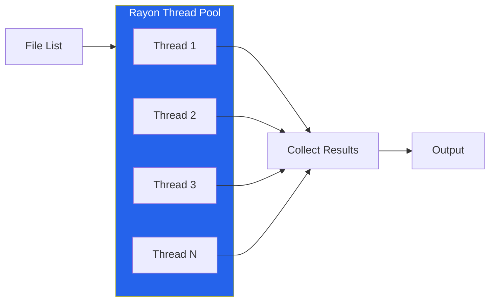

# Architecture

This document describes the internal architecture of UAST-Grep.

## High-Level Overview



## Scanning Flow



## Directory Structure

```
UAST-Grep/
├── native/uast_core/          # Rust core library
│   ├── src/
│   │   ├── bin/main.rs        # CLI entry point
│   │   ├── lib.rs             # Library entry point
│   │   ├── cli/               # CLI commands
│   │   │   ├── mod.rs         # Command definitions
│   │   │   ├── run.rs         # run command
│   │   │   ├── scan.rs        # scan command
│   │   │   ├── parse.rs       # parse command
│   │   │   ├── ts_query.rs    # ts-query command
│   │   │   ├── languages.rs   # languages command
│   │   │   └── output.rs      # Output formatting
│   │   ├── uast/              # UAST abstraction layer
│   │   │   ├── mod.rs         # UAST types
│   │   │   ├── schema.rs      # UAST schema definition
│   │   │   └── mappings.rs    # Language-to-UAST mappings
│   │   ├── matching/          # Pattern matching
│   │   │   ├── mod.rs         # Matcher interface
│   │   │   ├── pattern.rs     # Pattern AST types
│   │   │   ├── parser.rs      # Pattern parser
│   │   │   └── engine.rs      # Match execution
│   │   ├── rules/             # YAML rules engine
│   │   │   ├── mod.rs         # Rule types
│   │   │   ├── loader.rs      # YAML loading
│   │   │   └── scanner.rs     # Rule scanning
│   │   ├── sarif/             # SARIF output
│   │   │   └── mod.rs         # SARIF generator
│   │   ├── ffi.rs             # C FFI exports
│   │   ├── python.rs          # PyO3 bindings
│   │   ├── wasm_loader.rs     # WASM grammar loader
│   │   └── dynamic_loader.rs  # Dynamic library loader
│   ├── grammars/              # Grammar C sources
│   └── Cargo.toml             # Rust dependencies
├── python/                    # Python package
│   ├── uast_grep/             # Python module
│   │   └── __init__.py        # Public API
│   ├── tests/                 # pytest tests
│   └── pyproject.toml         # Python package config
├── src/UAST.Native/           # .NET bindings
│   ├── UastNative.cs          # P/Invoke declarations
│   └── UAST.Native.csproj     # .NET project
├── scripts/                   # Build scripts
│   ├── Build-NativeGrammars.ps1
│   └── Build-WasmGrammars.ps1
├── rules/                     # Sample YAML rules
└── docs/                      # Documentation (this)
```

## Core Components

### Component Relationships



### Language Registry

Manages available languages and their grammars:

```rust
pub struct LanguageRegistry {
    languages: HashMap<String, Language>,
    extensions: HashMap<String, String>,
}

pub struct Language {
    name: String,
    extensions: Vec<String>,
    grammar: tree_sitter::Language,
    uast_mappings: HashMap<String, Vec<String>>,
}
```

### Pattern Engine



Parses and matches patterns against ASTs:

```rust
// Pattern AST
pub enum PatternNode {
    Kind(UastKind),
    Metavar { name: String, quantifier: MetavarQuantifier },
    Sequence(Vec<PatternNode>),
    AnyOf(Vec<PatternNode>),
    AllOf(Vec<PatternNode>),
    Not(Box<PatternNode>),
    Native(String),
    Wildcard,
}

// Pattern matching
pub struct PatternMatcher {
    pattern: Pattern,
    language: Language,
}

impl PatternMatcher {
    pub fn matches(&self, tree: &Tree) -> Vec<Match> {
        // Walk tree and match pattern
    }
}
```

### Rules Engine



Loads and executes YAML rules:

```rust
pub struct Rule {
    id: String,
    language: String,
    severity: Severity,
    message: String,
    rule: RuleSpec,
    constraints: Option<Constraints>,
    fix: Option<String>,
}

pub enum RuleSpec {
    Pattern(String),
    Kind(String),
    Regex(String),
    Any(Vec<RuleSpec>),
    All(Vec<RuleSpec>),
    Not(Box<RuleSpec>),
    Has(Box<RuleSpec>),
    Inside(Box<RuleSpec>),
}
```

### UAST Layer



Maps universal types to language-specific nodes:

```rust
pub enum UastKind {
    FunctionDeclaration,
    ClassDeclaration,
    IfStatement,
    ForStatement,
    WhileStatement,
    CallExpression,
    // ... 30+ more types
}

pub fn get_native_types(uast_kind: UastKind, language: &str) -> Vec<&'static str> {
    // Return native tree-sitter types for this UAST kind
}
```

## FFI Layer

### C API (ffi.rs)

Exports C-compatible functions for .NET/other bindings:

```rust
#[no_mangle]
pub extern "C" fn uast_parser_new(language: *const c_char) -> *mut Parser { ... }

#[no_mangle]
pub extern "C" fn uast_parse(parser: *mut Parser, source: *const c_char, len: u32) -> *mut Tree { ... }

#[no_mangle]
pub extern "C" fn uast_tree_walk(tree: *mut Tree, callback: NodeCallback, user_data: *mut c_void) { ... }
```

### Python API (python.rs)

PyO3 bindings for Python:

```rust
#[pyclass]
pub struct UastParser {
    inner: Parser,
}

#[pymethods]
impl UastParser {
    #[new]
    pub fn new(language: &str) -> PyResult<Self> { ... }

    pub fn parse(&mut self, source: &str) -> PyResult<UastTree> { ... }
}

#[pymodule]
fn uast_grep(py: Python, m: &PyModule) -> PyResult<()> {
    m.add_class::<UastParser>()?;
    m.add_class::<PatternMatcher>()?;
    m.add_class::<RuleScanner>()?;
    Ok(())
}
```

## Grammar Loading

### Grammar Loading Strategy



### Built-in Grammars

Compiled directly into the binary:

```rust
#[cfg(feature = "builtin-grammars")]
fn register_builtin() {
    register("python", tree_sitter_python::language);
    register("rust", tree_sitter_rust::language);
    // ... 37 total
}
```

### WASM Grammars

Loaded on-demand via tree-sitter's WASM support:

```rust
pub fn load_wasm_grammar(name: &str) -> Result<Language> {
    let wasm_path = get_wasm_path(name)?;

    // Download if not cached
    if !wasm_path.exists() {
        download_wasm(name, &wasm_path)?;
    }

    // Load via tree-sitter
    let wasm_bytes = std::fs::read(&wasm_path)?;
    let language = Language::from_wasm(&wasm_bytes)?;
    Ok(language)
}
```

### Dynamic Grammars

Loaded from shared libraries:

```rust
pub fn load_dynamic_grammar(path: &Path) -> Result<Language> {
    let lib = libloading::Library::new(path)?;
    let func: Symbol<unsafe extern "C" fn() -> Language> =
        lib.get(b"tree_sitter_language")?;
    Ok(unsafe { func() })
}
```

## Performance Considerations

### Parallel Scanning



Uses Rayon for parallel file processing:

```rust
files.par_iter()
    .filter_map(|path| scan_file(path, &pattern, &language))
    .collect()
```

### Memory Management

- Trees are reference-counted
- Parsers are reused across files
- Large files processed in chunks

### Caching

- WASM grammars cached on disk
- Compiled patterns cached per-language
- Query results not cached (stateless)

## Error Handling

Uses `thiserror` for structured errors:

```rust
#[derive(Debug, thiserror::Error)]
pub enum UastError {
    #[error("Unknown language: {0}")]
    UnknownLanguage(String),

    #[error("Parse error in {file} at line {line}")]
    ParseError { file: String, line: usize },

    #[error("Invalid pattern: {0}")]
    PatternError(String),

    #[error("Rule error: {0}")]
    RuleError(String),
}
```

## Testing Strategy

### Unit Tests

```rust
#[cfg(test)]
mod tests {
    #[test]
    fn test_pattern_parsing() { ... }

    #[test]
    fn test_uast_mapping() { ... }
}
```

### Integration Tests

```rust
// tests/integration_test.rs
#[test]
fn test_full_scan() {
    let result = Command::new("uast-grep")
        .args(&["scan", "-r", "rules/test.yaml", "./fixtures"])
        .output()
        .expect("Failed to run");
    assert!(result.status.success());
}
```

### Benchmarks

```rust
// benches/parsing.rs
use criterion::{criterion_group, Criterion};

fn bench_parse(c: &mut Criterion) {
    c.bench_function("parse_python", |b| {
        b.iter(|| parse_file("fixtures/large.py", "python"))
    });
}
```

## Extension Points

### Adding New Commands

1. Create `cli/new_command.rs`
2. Add to `cli/mod.rs` enum
3. Implement `execute()` function

### Adding Output Formats

1. Create formatter in `cli/output.rs`
2. Add to format selection logic
3. Implement `format()` trait method

### Adding Rule Types

1. Extend `RuleSpec` enum
2. Add parsing logic in `rules/loader.rs`
3. Implement matching in `rules/scanner.rs`
