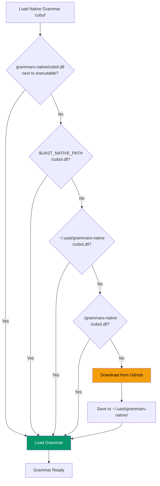

# Native Grammar Languages

Some languages cannot be compiled to WebAssembly (WASM) due to external scanner complexity or C library dependencies. These languages are provided as **native dynamic libraries** (.dll, .so, .dylib).

## Why Native Instead of WASM?

Three languages require native loading:

| Language | Reason | C Dependencies |
|----------|--------|----------------|
| **COBOL** | Uses C99 Variable Length Arrays (VLA) | VLA not supported in WASM |
| **Doxygen** | External scanner uses C stdio | `fprintf`, `stderr`, `isalnum` |
| **Vim** | External scanner uses wide character functions | `iswpunct` |

These functions are not available in the WebAssembly sandbox, so native compilation is required.

## How Native Loading Works

UAST-Grep searches for native grammars in this priority order:

1. **Next to executable** - `grammars-native/` folder beside the CLI binary
2. **Environment variable** - `$UAST_NATIVE_PATH` directory
3. **User cache** - `~/.uast/grammars-native/` (or `%USERPROFILE%\.uast\grammars-native\` on Windows)
4. **Working directory** - `grammars-native/` in current directory
5. **Download** - If not found locally, downloads from GitHub Releases and caches



### Platform-Specific Extensions

| Platform | Extension | Example |
|----------|-----------|---------|
| **Windows** | `.dll` | `cobol.dll` |
| **Linux** | `.so` | `cobol.so` |
| **macOS** | `.dylib` | `cobol.dylib` |

## Available Native Languages

### COBOL

| Property | Value |
|----------|-------|
| **Extensions** | `.cob`, `.cbl`, `.cpy` |
| **Grammar Size** | ~14 MB |
| **Use Case** | Legacy mainframe systems, financial applications |

```bash
# Find all paragraphs
uast-grep run -p paragraph -l cobol ./src

# Find PERFORM statements
uast-grep run -p perform_statement -l cobol ./src

# Find data divisions
uast-grep run -p data_division -l cobol ./src
```

### Doxygen

| Property | Value |
|----------|-------|
| **Extensions** | Various (embedded in source files) |
| **Grammar Size** | ~150 KB |
| **Use Case** | Documentation comment parsing |

```bash
# Find all Doxygen blocks
uast-grep run -p document -l doxygen ./include

# Find @param tags
uast-grep run -p tag -l doxygen ./include

# Find brief descriptions
uast-grep run -p brief -l doxygen ./include
```

### Vim Script

| Property | Value |
|----------|-------|
| **Extensions** | `.vim`, `.vimrc` |
| **Grammar Size** | ~1.4 MB |
| **Use Case** | Vim configuration and plugins |

```bash
# Find all functions
uast-grep run -p function_definition -l vim ~/.vim

# Find keymaps
uast-grep run -p map_statement -l vim ~/.vim

# Find autocommands
uast-grep run -p autocmd_statement -l vim ~/.vim
```

## Installation

### Download from Release

Download platform-specific files from [GitHub Releases](https://github.com/Variably-Constant/UAST-Grep/releases):

**Windows:**
```powershell
# Download native grammars
Invoke-WebRequest -Uri "https://github.com/Variably-Constant/UAST-Grep/releases/latest/download/cobol.dll" -OutFile "$env:USERPROFILE\.uast\grammars-native\cobol.dll"
Invoke-WebRequest -Uri "https://github.com/Variably-Constant/UAST-Grep/releases/latest/download/doxygen.dll" -OutFile "$env:USERPROFILE\.uast\grammars-native\doxygen.dll"
Invoke-WebRequest -Uri "https://github.com/Variably-Constant/UAST-Grep/releases/latest/download/vim.dll" -OutFile "$env:USERPROFILE\.uast\grammars-native\vim.dll"
```

**Linux:**
```bash
# Create directory
mkdir -p ~/.uast/grammars-native

# Download native grammars
curl -Lo ~/.uast/grammars-native/cobol.so https://github.com/Variably-Constant/UAST-Grep/releases/latest/download/cobol.so
curl -Lo ~/.uast/grammars-native/doxygen.so https://github.com/Variably-Constant/UAST-Grep/releases/latest/download/doxygen.so
curl -Lo ~/.uast/grammars-native/vim.so https://github.com/Variably-Constant/UAST-Grep/releases/latest/download/vim.so
```

**macOS:**
```bash
# Create directory
mkdir -p ~/.uast/grammars-native

# Download native grammars
curl -Lo ~/.uast/grammars-native/cobol.dylib https://github.com/Variably-Constant/UAST-Grep/releases/latest/download/cobol.dylib
curl -Lo ~/.uast/grammars-native/doxygen.dylib https://github.com/Variably-Constant/UAST-Grep/releases/latest/download/doxygen.dylib
curl -Lo ~/.uast/grammars-native/vim.dylib https://github.com/Variably-Constant/UAST-Grep/releases/latest/download/vim.dylib
```

### Portable Installation

For portable use, place native files next to the executable:

```
uast-grep.exe (or uast-grep on Unix)
grammars-native/
├── cobol.dll (or .so/.dylib)
├── doxygen.dll
└── vim.dll
```

### Custom Path

```bash
# Use custom directory
export UAST_NATIVE_PATH=/shared/grammars-native/

# Or on Windows
set UAST_NATIVE_PATH=C:\shared\grammars-native
```

## Offline Usage

### Disable Auto-Download

```bash
# Prevent any downloads
export UAST_OFFLINE=1

# Now this will error if grammar not found locally
uast-grep run -p paragraph -l cobol ./src
# Error: Native grammar 'cobol' not found and offline mode enabled
```

### Checking Cache

```bash
# List cached native grammars (Unix)
ls -la ~/.uast/grammars-native/

# List cached grammars (Windows)
dir %USERPROFILE%\.uast\grammars-native\
```

### Clearing Cache

```bash
# Remove all cached native grammars
rm -rf ~/.uast/grammars-native/

# Remove specific grammar
rm ~/.uast/grammars-native/cobol.dll
```

## Security Considerations

Native DLLs execute code directly on your system (unlike WASM which runs in a sandbox). Always:

1. **Download from official releases** - Only use grammars from the official GitHub releases
2. **Verify checksums** - Compare SHA256 checksums from `checksums.txt`
3. **Avoid untrusted sources** - Never load DLLs from unknown sources

## Troubleshooting

### Grammar Not Found

```bash
# Check if grammar exists in cache
ls ~/.uast/grammars-native/cobol.*

# Check environment variable
echo $UAST_NATIVE_PATH
```

### Permission Denied (Unix)

```bash
# Make library executable
chmod 755 ~/.uast/grammars-native/*.so
chmod 755 ~/.uast/grammars-native/*.dylib
```

### Loading Error

If a native grammar fails to load:

```bash
# Check library dependencies (Linux)
ldd ~/.uast/grammars-native/cobol.so

# Check library dependencies (macOS)
otool -L ~/.uast/grammars-native/cobol.dylib
```

### Wrong Platform

Native grammars are platform-specific. Ensure you downloaded the correct file:
- Windows: `.dll`
- Linux: `.so`
- macOS: `.dylib`

## Performance Notes

- **Load time:** <100ms (native code loads quickly)
- **Parse speed:** Identical to built-in grammars
- **Memory:** Native grammars use system memory (not WASM sandbox)

Native grammars perform identically to built-in grammars since they use the same tree-sitter FFI interface.
