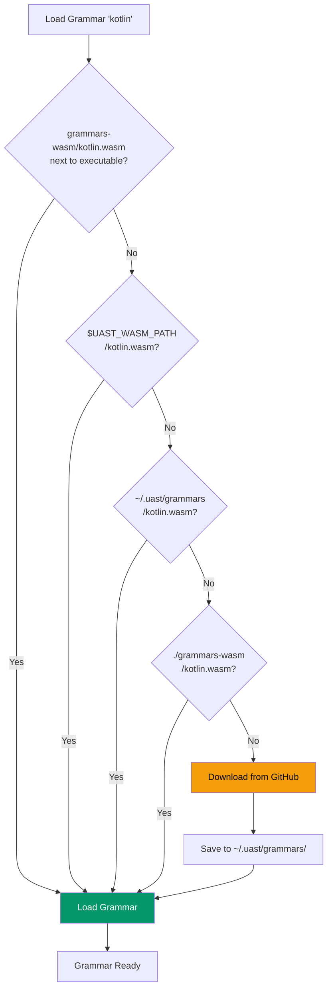

# WASM Languages

WASM (WebAssembly) languages are loaded from local files or downloaded on first use and cached.

## How WASM Loading Works

UAST-Grep searches for WASM grammars in this priority order:

1. **Next to executable** - `grammars-wasm/` folder beside the CLI binary
2. **Environment variable** - `$UAST_WASM_PATH` directory
3. **User cache** - `~/.uast/grammars/` (or `%USERPROFILE%\.uast\grammars\` on Windows)
4. **Working directory** - `grammars-wasm/` in current directory
5. **Download** - If not found locally, downloads from GitHub Releases and caches



### Portable Installation

For portable/air-gapped use, simply drop WASM files next to the executable:

```
uast-grep.exe
grammars-wasm/
├── kotlin.wasm
├── scala.wasm
├── swift.wasm
└── sql.wasm
```

No environment variables or configuration needed!

## Available WASM Languages

### Large Grammar Languages

These languages have grammars too large for built-in inclusion:

| Language | Extensions | Grammar Size |
|----------|------------|--------------|
| **Kotlin** | `.kt`, `.kts` | ~5MB |
| **Scala** | `.scala`, `.sc` | ~4MB |
| **Swift** | `.swift` | ~3MB |
| **SQL** | `.sql` | ~10MB |
| **LaTeX** | `.tex`, `.sty` | ~4MB |
| **Verilog** | `.v`, `.sv` | ~18MB |
| **Fortran** | `.f`, `.f90`, `.f95` | ~7MB |
| **F#** | `.fs`, `.fsi`, `.fsx` | ~6MB |

> **Note:** COBOL, Doxygen, and Vim cannot compile to WASM and are provided as [Native Languages](native.md) instead.

### System Languages

| Language | Extensions | Notes |
|----------|------------|-------|
| **Objective-C** | `.m`, `.mm` | macOS/iOS development |
| **Julia** | `.jl` | Scientific computing |
| **D** | `.d` | Systems programming |
| **Crystal** | `.cr` | Ruby-like compiled |
| **CUDA** | `.cu`, `.cuh` | GPU programming |
| **Haskell** | `.hs`, `.lhs` | Functional programming |
| **Perl** | `.pl`, `.pm` | Text processing |

### Specialized Languages

| Language | Extensions | Use Case |
|----------|------------|----------|
| **Arduino** | `.ino` | Embedded systems |
| **Agda** | `.agda` | Proof assistant |
| **OCaml** | `.ml`, `.mli` | Functional programming |
| **Apex** | `.cls`, `.trigger` | Salesforce |
| **Dart** | `.dart` | Flutter/mobile |
| **Groovy** | `.groovy`, `.gvy` | JVM scripting |
| **Common Lisp** | `.lisp`, `.cl` | AI/symbolic |

### Modern Languages

| Language | Extensions | Notes |
|----------|------------|-------|
| **Zig** | `.zig` | Systems programming |
| **AWK** | `.awk` | Text processing |
| **R** | `.r`, `.R` | Statistics |
| **Cairo** | `.cairo` | Blockchain |
| **Dhall** | `.dhall` | Configuration |
| **CUE** | `.cue` | Data validation |
| **Ada** | `.adb`, `.ads` | Safety-critical |
| **Bitbake** | `.bb`, `.bbappend` | Yocto/OpenEmbedded |

### Meta Languages

| Language | Extensions | Purpose |
|----------|------------|---------|
| **Comment** | Various | Generic comment parsing |

> **Note:** Doxygen is available as a [Native Language](native.md) due to C library dependencies.

## Using WASM Languages

### Basic Usage

```bash
# First use downloads the grammar
uast-grep run -p function_declaration -l kotlin ./src
# Downloading kotlin grammar... done (5.2MB)
# [results...]

# Subsequent uses are instant
uast-grep run -p function_declaration -l kotlin ./src
```

### Checking Cache

```bash
# List cached grammars (Unix)
ls -la ~/.uast/grammars/

# List cached grammars (Windows)
dir %USERPROFILE%\.uast\grammars\
```

### Clearing Cache

```bash
# Remove all cached grammars
rm -rf ~/.uast/grammars/

# Remove specific grammar
rm ~/.uast/grammars/kotlin.wasm
```

## Offline Usage

### Pre-download All Grammars

```bash
# Download the complete bundle
curl -LO https://github.com/Variably-Constant/UAST-Grep/releases/latest/download/grammars-wasm.zip

# Extract to cache directory
unzip grammars-wasm.zip -d ~/.uast/grammars/
```

### Disable Auto-Download

```bash
# Prevent any downloads
export UAST_OFFLINE=1

# Now this will error if grammar not cached
uast-grep run -p function_declaration -l kotlin ./src
# Error: Grammar 'kotlin' not found and offline mode enabled
```

### Custom Grammar Location

```bash
# Use custom directory
export UAST_WASM_PATH=/shared/grammars/

# Or on Windows
set UAST_WASM_PATH=C:\shared\grammars
```

### Custom Download URL

For internal mirrors or air-gapped environments:

```bash
export UAST_WASM_URL=https://internal-server/grammars/

# Grammars will be downloaded from:
# https://internal-server/grammars/kotlin.wasm
```

## WASM Language Examples

### Kotlin

```bash
# Find all functions
uast-grep run -p function_declaration -l kotlin ./src

# Find data classes
uast-grep run -p class_declaration -l kotlin ./src

# Find when expressions
uast-grep run -p when_expression -l kotlin ./src
```

### Scala

```bash
# Find all functions
uast-grep run -p function_definition -l scala ./src

# Find case classes
uast-grep run -p class_definition -l scala ./src

# Find pattern matching
uast-grep run -p match_expression -l scala ./src
```

### Swift

```bash
# Find all functions
uast-grep run -p function_declaration -l swift ./Sources

# Find classes
uast-grep run -p class_declaration -l swift ./Sources

# Find optionals
uast-grep run -p optional_type -l swift ./Sources
```

### SQL

```bash
# Find all SELECT statements
uast-grep run -p select_statement -l sql ./queries

# Find JOIN clauses
uast-grep run -p join_clause -l sql ./queries

# Find subqueries
uast-grep run -p subquery -l sql ./queries
```

### Haskell

```bash
# Find all functions
uast-grep run -p function -l haskell ./src

# Find type declarations
uast-grep run -p type_signature -l haskell ./src

# Find pattern matching
uast-grep run -p match -l haskell ./src
```

### Julia

```bash
# Find all functions
uast-grep run -p function_definition -l julia ./src

# Find macros
uast-grep run -p macro_definition -l julia ./src
```

## Troubleshooting

### Download Fails

```bash
# Check network connectivity
curl -I https://github.com/Variably-Constant/UAST-Grep/releases/

# Check DNS
nslookup github.com

# Try with verbose output
uast-grep run -p function -l kotlin ./src --verbose
```

### Grammar Not Found

```bash
# Verify language name
uast-grep languages | grep -i kotlin

# Check if grammar exists in cache
ls ~/.uast/grammars/kotlin.wasm
```

### Cache Corruption

```bash
# Remove and re-download
rm ~/.uast/grammars/kotlin.wasm
uast-grep run -p function -l kotlin ./src
```

### Permissions Issues

```bash
# Check cache directory permissions
ls -la ~/.uast/

# Fix permissions
chmod 755 ~/.uast/
chmod 644 ~/.uast/grammars/*
```

## Performance Notes

- **First load:** 1-5 seconds (depending on grammar size and network)
- **Cached load:** <100ms
- **Parse speed:** Same as built-in languages

WASM grammars have nearly identical performance to built-in grammars after loading.
