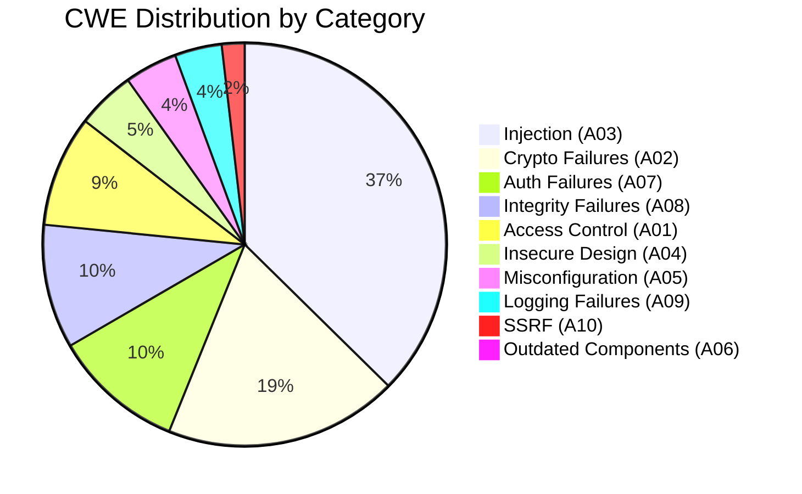
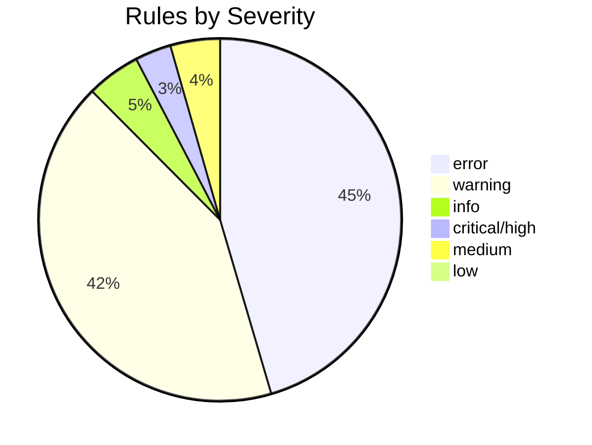

# CWE & OWASP Coverage Report

Comprehensive coverage of **179 CWE identifiers** and mapping to **OWASP Top 10 2021** categories.

## Coverage Summary

| Metric | Count |
|--------|-------|
| **CWE Identifiers** | 179 |
| **OWASP Top 10 Categories** | 10/10 (100%) |
| **Languages with CWE Rules** | 31 |
| **Total Security Rules** | 1,587 |

---

## OWASP Top 10 2021 Coverage

UAST-Grep provides comprehensive coverage for all OWASP Top 10 2021 categories:

### A01:2021 - Broken Access Control

> Previously #5, now the most common vulnerability category.

| CWE | Description | Rules | Languages |
|-----|-------------|-------|-----------|
| CWE-22 | Path Traversal | 39 | Python, Java, JavaScript, Go, Ruby, PHP, C#, Rust, C, Lua, Clojure, Scala |
| CWE-73 | External Control of File Name | 4 | Python, Java, Go, PHP |
| CWE-284 | Improper Access Control | 3 | Java, C#, Go |
| CWE-601 | Open Redirect | 12 | Python, Java, JavaScript, Go, Ruby, C#, Lua, Clojure, Scala |
| CWE-639 | Authorization Bypass | 2 | Java, Ruby |
| CWE-732 | Incorrect Permission Assignment | 9 | Python, Java, Go, Ruby, C, Bash, HCL |
| CWE-862 | Missing Authorization | 2 | Java, Ruby |
| CWE-915 | Mass Assignment | 7 | Java, Go, Ruby, PHP |

**Total A01 Rules: 78** | **OWASP Tags: 76 rules**

---

### A02:2021 - Cryptographic Failures

> Previously "Sensitive Data Exposure" - focuses on crypto-related failures.

| CWE | Description | Rules | Languages |
|-----|-------------|-------|-----------|
| CWE-256 | Plaintext Storage of Password | 2 | Java, C# |
| CWE-259 | Hardcoded Password | 3 | Java, Go, C# |
| CWE-311 | Missing Encryption | 2 | Kotlin |
| CWE-312 | Cleartext Storage | 7 | Kotlin, PowerShell, Bash |
| CWE-319 | Cleartext Transmission | 10 | Python, Go, Ruby, C#, Rust, Clojure |
| CWE-321 | Hardcoded Crypto Key | 12 | Python, Java, JavaScript, C#, Ruby, Rust, C, Clojure, Scala |
| CWE-326 | Inadequate Encryption Strength | 20 | Java, Python, Go, C#, Clojure, Scala, HCL, YAML |
| CWE-327 | Broken Cryptographic Algorithm | 53 | Java, Python, Go, C#, JavaScript, Ruby, Rust, Kotlin, Scala, Clojure, C, YAML |
| CWE-328 | Weak Hash (MD5/SHA1) | 13 | Python, Java, Go, C, Lua, Clojure, Scala |
| CWE-329 | Not Using Random IV | 7 | Java, Python, Go, Ruby, C, Clojure, Scala |
| CWE-330 | Insufficient Randomness | 16 | Python, Java, Go, JavaScript, C#, Ruby, Rust, C, Lua, Clojure, Scala, Bash |
| CWE-331 | Insufficient Entropy | 1 | Python |
| CWE-338 | Cryptographic PRNG | 10 | Python, JavaScript, Go, Kotlin, Lua |
| CWE-759 | No Salt in Password Hash | 1 | Python |
| CWE-916 | Insufficient Password Strength | 7 | Python, Java, Go, Ruby, C#, Kotlin |

**Total A02 Rules: 164** | **OWASP Tags: 106 rules**

---

### A03:2021 - Injection

> Still a major threat category, now includes XSS.

| CWE | Description | Rules | Languages |
|-----|-------------|-------|-----------|
| CWE-78 | OS Command Injection | 85 | Python, Java, Go, Ruby, PHP, JavaScript, C#, PowerShell, Bash, Rust, Kotlin, Scala, Clojure, Lua, C, YAML |
| CWE-79 | Cross-Site Scripting (XSS) | 41 | JavaScript, Java, Python, Go, Ruby, PHP, C#, Scala, Clojure |
| CWE-89 | SQL Injection | 58 | Python, Java, Go, Ruby, PHP, JavaScript, C#, Rust, Kotlin, Scala, Clojure, Lua, Bash |
| CWE-90 | LDAP Injection | 4 | Java, C#, Ruby, Python |
| CWE-91 | XML Injection | 3 | Java, Python, C# |
| CWE-94 | Code Injection | 101 | Python, Java, JavaScript, C#, PowerShell, Ruby, PHP, Bash, Go, Rust, Scala, Clojure, Lua, TypeScript, YAML |
| CWE-95 | Eval Injection | 2 | Python, JavaScript |
| CWE-117 | Log Injection | 8 | Java, Python, Go, C#, Bash, Lua, Scala |
| CWE-134 | Format String Vulnerability | 11 | C, Bash, C# |
| CWE-643 | XPath Injection | 3 | Java, Python, C# |
| CWE-917 | Expression Language Injection | 6 | Java, C# |
| CWE-1336 | Template Injection (SSTI) | 5 | Python, Java, Ruby |

**Total A03 Rules: 327** | **OWASP Tags: 166 rules**

---

### A04:2021 - Insecure Design

> New category focusing on design-level security flaws.

| CWE | Description | Rules | Languages |
|-----|-------------|-------|-----------|
| CWE-209 | Error Message Info Leak | 16 | Java, Python, JavaScript, Go, Ruby, C#, Rust, Lua, Clojure, Scala |
| CWE-215 | Debug Mode Exposure | 3 | Python |
| CWE-352 | CSRF | 8 | Java, Python, JavaScript, Go, Ruby, C#, Clojure |
| CWE-362 | Race Condition | 3 | Java, Go, Ruby |
| CWE-367 | TOCTOU Race Condition | 11 | C, Go, Java, Bash, C#, Rust, Lua |

**Total A04 Rules: 41** | **OWASP Tags: 32 rules**

---

### A05:2021 - Security Misconfiguration

> Includes misconfigured permissions, default credentials, unnecessary features.

| CWE | Description | Rules | Languages |
|-----|-------------|-------|-----------|
| CWE-200 | Information Exposure | 20 | Java, Go, C#, Bash, Dockerfile, Lua, Scala, HCL, YAML |
| CWE-250 | Unnecessary Privileges | 3 | Go, Java, C |
| CWE-276 | Incorrect Default Permissions | 4 | Python, Go, Bash, C |
| CWE-489 | Active Debug Code | 3 | Python, Lua |
| CWE-522 | Insufficiently Protected Credentials | 2 | Java, JavaScript |
| CWE-548 | Directory Listing | 1 | Java |
| CWE-668 | Exposure to Wrong Sphere | 2 | Java, C# |
| CWE-778 | Insufficient Logging | 2 | Java, Python |

**Total A05 Rules: 37** | **OWASP Tags: 41 rules**

---

### A06:2021 - Vulnerable and Outdated Components

> Using components with known vulnerabilities.

| CWE | Description | Rules | Languages |
|-----|-------------|-------|-----------|
| CWE-829 | Inclusion of Untrusted Code | 5 | PowerShell, Ruby, Lua |
| CWE-1104 | Use of Unmaintained Third-Party | 2 | JavaScript, Python |

**Total A06 Rules: 7** | **OWASP Tags: 14 rules**

---

### A07:2021 - Identification and Authentication Failures

> Previously "Broken Authentication" - expanded scope.

| CWE | Description | Rules | Languages |
|-----|-------------|-------|-----------|
| CWE-306 | Missing Authentication | 2 | Java, C# |
| CWE-347 | Improper JWT Verification | 13 | Java, Python, JavaScript, Go, C#, Ruby, Clojure, Scala |
| CWE-384 | Session Fixation | 3 | Java, Python, Ruby |
| CWE-521 | Weak Password Requirements | 3 | JavaScript, C# |
| CWE-613 | Insufficient Session Expiration | 2 | Java, Python |
| CWE-614 | Insecure Cookie | 10 | Python, JavaScript, Go, Ruby, C#, Clojure, Scala |
| CWE-798 | Hardcoded Credentials | 54 | Python, Java, JavaScript, Go, C#, Ruby, PowerShell, Bash, Rust, Kotlin, C, Lua, Clojure, Scala, Dockerfile, HCL, YAML |
| CWE-1004 | Missing HttpOnly Flag | 5 | Python, Go, C#, Clojure |

**Total A07 Rules: 92** | **OWASP Tags: 37 rules**

---

### A08:2021 - Software and Data Integrity Failures

> New category covering CI/CD security, deserialization, unsigned code.

| CWE | Description | Rules | Languages |
|-----|-------------|-------|-----------|
| CWE-345 | Insufficient Verification of Data | 2 | Java, Python |
| CWE-346 | Origin Validation Error | 2 | JavaScript, Java |
| CWE-470 | Use of Externally-Controlled Input | 2 | Java, Python |
| CWE-494 | Download Without Integrity Check | 4 | Bash, Go, Python, PowerShell |
| CWE-502 | Insecure Deserialization | 73 | Python, Java, C#, Ruby, PHP, JavaScript, Go, Rust, Kotlin, Scala, Clojure, Lua, Elixir |
| CWE-913 | Improper Resource Shutdown | 2 | Go, Java |
| CWE-1321 | Prototype Pollution | 2 | JavaScript, Lua |

**Total A08 Rules: 87** | **OWASP Tags: 47 rules**

---

### A09:2021 - Security Logging and Monitoring Failures

> Insufficient logging, detection, monitoring, and response.

| CWE | Description | Rules | Languages |
|-----|-------------|-------|-----------|
| CWE-117 | Log Injection | 8 | Java, Python, Go, C#, Bash, Lua, Scala |
| CWE-390 | Empty Exception Handler | 3 | Clojure |
| CWE-532 | Sensitive Info in Logs | 20 | Java, Python, JavaScript, C#, Ruby, Rust, Kotlin, Bash, Clojure, Scala, YAML |
| CWE-778 | Insufficient Logging | 2 | Java, Python |

**Total A09 Rules: 33** | **OWASP Tags: 15 rules**

---

### A10:2021 - Server-Side Request Forgery (SSRF)

> New dedicated category for SSRF attacks.

| CWE | Description | Rules | Languages |
|-----|-------------|-------|-----------|
| CWE-918 | Server-Side Request Forgery | 16 | Python, Java, JavaScript, Go, Ruby, Rust, Clojure, Scala |

**Total A10 Rules: 16** | **OWASP Tags: 15 rules**

---

## Complete CWE Coverage List

### All 179 CWEs by Category

#### Input Validation (CWE-20 Family)
| CWE | Name | Rules |
|-----|------|-------|
| CWE-20 | Improper Input Validation | 3 |
| CWE-22 | Path Traversal | 39 |
| CWE-59 | Symlink Following | 2 |
| CWE-73 | External Control of File Name | 4 |
| CWE-74 | Improper Neutralization | 1 |
| CWE-78 | OS Command Injection | 85 |
| CWE-79 | Cross-Site Scripting | 41 |
| CWE-89 | SQL Injection | 58 |
| CWE-90 | LDAP Injection | 4 |
| CWE-91 | XML Injection | 3 |
| CWE-93 | CRLF Injection | 2 |
| CWE-94 | Code Injection | 101 |
| CWE-95 | Eval Injection | 2 |
| CWE-98 | Improper Control of Filename | 2 |
| CWE-113 | HTTP Response Splitting | 2 |
| CWE-117 | Log Injection | 8 |

#### Memory Safety (CWE-119 Family)
| CWE | Name | Rules |
|-----|------|-------|
| CWE-119 | Buffer Overflow | 11 |
| CWE-120 | Classic Buffer Overflow | 19 |
| CWE-121 | Stack-based Overflow | 2 |
| CWE-122 | Heap-based Overflow | 2 |
| CWE-125 | Out-of-bounds Read | 3 |
| CWE-129 | Improper Array Index | 2 |
| CWE-134 | Format String | 11 |
| CWE-170 | Null Termination | 1 |
| CWE-190 | Integer Overflow | 5 |
| CWE-191 | Integer Underflow | 1 |
| CWE-401 | Memory Leak | 3 |
| CWE-415 | Double Free | 1 |
| CWE-416 | Use After Free | 1 |
| CWE-476 | NULL Pointer Dereference | 7 |
| CWE-787 | Out-of-bounds Write | 7 |

#### Cryptographic Issues (CWE-310 Family)
| CWE | Name | Rules |
|-----|------|-------|
| CWE-311 | Missing Encryption | 2 |
| CWE-312 | Cleartext Storage | 7 |
| CWE-319 | Cleartext Transmission | 10 |
| CWE-321 | Hardcoded Crypto Key | 12 |
| CWE-326 | Inadequate Key Size | 20 |
| CWE-327 | Broken Algorithm | 53 |
| CWE-328 | Weak Hash | 13 |
| CWE-329 | No Random IV | 7 |
| CWE-330 | Insufficient Randomness | 16 |
| CWE-331 | Insufficient Entropy | 1 |
| CWE-337 | Predictable Seed | 1 |
| CWE-338 | Cryptographic PRNG | 10 |
| CWE-759 | No Salt | 1 |
| CWE-916 | Weak Password Hash | 7 |

#### Authentication (CWE-287 Family)
| CWE | Name | Rules |
|-----|------|-------|
| CWE-256 | Plaintext Password Storage | 2 |
| CWE-258 | Empty Password | 1 |
| CWE-259 | Hardcoded Password | 3 |
| CWE-284 | Improper Access Control | 3 |
| CWE-306 | Missing Authentication | 2 |
| CWE-347 | JWT Verification | 13 |
| CWE-352 | CSRF | 8 |
| CWE-384 | Session Fixation | 3 |
| CWE-521 | Weak Password Policy | 3 |
| CWE-522 | Insufficiently Protected | 2 |
| CWE-613 | Session Expiration | 2 |
| CWE-614 | Insecure Cookie | 10 |
| CWE-798 | Hardcoded Credentials | 54 |
| CWE-862 | Missing Authorization | 2 |
| CWE-1004 | Missing HttpOnly | 5 |

#### Resource Management (CWE-400 Family)
| CWE | Name | Rules |
|-----|------|-------|
| CWE-400 | Resource Exhaustion | 22 |
| CWE-404 | Improper Resource Shutdown | 3 |
| CWE-409 | Compression Bomb | 1 |
| CWE-770 | Allocation Without Limits | 3 |
| CWE-789 | Uncontrolled Memory Allocation | 1 |
| CWE-835 | Infinite Loop | 3 |
| CWE-1333 | ReDoS | 15 |

#### Error Handling (CWE-388 Family)
| CWE | Name | Rules |
|-----|------|-------|
| CWE-390 | Empty Catch Block | 3 |
| CWE-754 | Improper Check for Unusual | 2 |
| CWE-755 | Improper Handling of Exceptional | 1 |

---

## Coverage Visualization





---

## High-Impact CWEs (Most Rules)

Top 20 CWEs by rule count:

| Rank | CWE | Name | Rules | Languages |
|------|-----|------|-------|-----------|
| 1 | CWE-94 | Code Injection | 101 | 18 |
| 2 | CWE-78 | Command Injection | 85 | 21 |
| 3 | CWE-502 | Insecure Deserialization | 73 | 13 |
| 4 | CWE-89 | SQL Injection | 58 | 13 |
| 5 | CWE-798 | Hardcoded Credentials | 54 | 17 |
| 6 | CWE-327 | Broken Crypto | 53 | 12 |
| 7 | CWE-79 | XSS | 41 | 9 |
| 8 | CWE-22 | Path Traversal | 39 | 12 |
| 9 | CWE-295 | Certificate Validation | 32 | 15 |
| 10 | CWE-400 | Resource Exhaustion | 22 | 9 |
| 11 | CWE-611 | XXE | 23 | 7 |
| 12 | CWE-200 | Information Exposure | 20 | 9 |
| 13 | CWE-326 | Inadequate Key Size | 20 | 8 |
| 14 | CWE-532 | Sensitive Logging | 20 | 10 |
| 15 | CWE-120 | Buffer Overflow | 19 | 2 |
| 16 | CWE-918 | SSRF | 16 | 8 |
| 17 | CWE-209 | Error Information | 16 | 10 |
| 18 | CWE-330 | Weak Random | 16 | 11 |
| 19 | CWE-1333 | ReDoS | 15 | 9 |
| 20 | CWE-328 | Weak Hash | 13 | 7 |

---

## Language Coverage by OWASP Category

| Language | A01 | A02 | A03 | A04 | A05 | A06 | A07 | A08 | A09 | A10 |
|----------|-----|-----|-----|-----|-----|-----|-----|-----|-----|-----|
| Python | ✅ | ✅ | ✅ | ✅ | ✅ | ✅ | ✅ | ✅ | ✅ | ✅ |
| Java | ✅ | ✅ | ✅ | ✅ | ✅ | ⚠️ | ✅ | ✅ | ✅ | ✅ |
| JavaScript | ✅ | ✅ | ✅ | ✅ | ✅ | ✅ | ✅ | ✅ | ✅ | ✅ |
| C# | ✅ | ✅ | ✅ | ✅ | ✅ | ⚠️ | ✅ | ✅ | ✅ | ⚠️ |
| Go | ✅ | ✅ | ✅ | ✅ | ✅ | ✅ | ✅ | ✅ | ✅ | ✅ |
| Ruby | ✅ | ✅ | ✅ | ✅ | ✅ | ✅ | ✅ | ✅ | ✅ | ✅ |
| PHP | ✅ | ⚠️ | ✅ | ⚠️ | ⚠️ | ⚠️ | ⚠️ | ✅ | ⚠️ | ⚠️ |
| Rust | ✅ | ✅ | ✅ | ✅ | ⚠️ | ⚠️ | ✅ | ✅ | ✅ | ✅ |
| Kotlin | ⚠️ | ✅ | ✅ | ⚠️ | ⚠️ | ⚠️ | ✅ | ✅ | ✅ | ⚠️ |
| Scala | ✅ | ✅ | ✅ | ⚠️ | ✅ | ⚠️ | ✅ | ✅ | ✅ | ✅ |
| PowerShell | ⚠️ | ✅ | ✅ | ⚠️ | ⚠️ | ✅ | ✅ | ⚠️ | ⚠️ | ⚠️ |

✅ = Multiple rules | ⚠️ = Limited coverage | ❌ = No coverage

---

## Using CWE-Specific Rules

### Find Rules by CWE

```bash
# Scan for SQL injection only
uast-grep scan -r rules/universal-security.yaml --tags CWE-89 ./src

# Scan for all injection types
uast-grep scan -r rules/universal-security.yaml --tags injection ./src
```

### Generate CWE Report

```bash
# SARIF output includes CWE mappings
uast-grep scan -r rules/universal-security.yaml -f sarif ./src > results.sarif
```

The SARIF output includes:
- `taxa` array with all CWE references
- `ruleId` linked to CWE identifiers
- `relationships` mapping rules to CWEs

---

## Compliance Mapping

### PCI DSS 4.0

| Requirement | UAST-Grep Coverage |
|-------------|-------------------|
| 6.2.4 - Code review | All security rules |
| 6.3.1 - Security vulnerabilities | CWE-78, CWE-89, CWE-79, CWE-94 |
| 6.3.2 - Cryptographic controls | CWE-327, CWE-328, CWE-326 |
| 8.3.1 - Authentication | CWE-798, CWE-521, CWE-384 |

### HIPAA Security Rule

| Standard | UAST-Grep Coverage |
|----------|-------------------|
| Access Controls | CWE-284, CWE-862, CWE-732 |
| Audit Controls | CWE-778, CWE-532 |
| Transmission Security | CWE-319, CWE-295 |
| Encryption | CWE-327, CWE-326, CWE-311 |

### SOC 2 Type II

| Criteria | UAST-Grep Coverage |
|----------|-------------------|
| CC6.1 - Logical Access | CWE-284, CWE-798, CWE-862 |
| CC6.6 - System Monitoring | CWE-778, CWE-117 |
| CC6.7 - Transmission Integrity | CWE-319, CWE-295 |
| CC7.1 - Configuration Management | CWE-489, CWE-668 |

---

## Resources

- [MITRE CWE Database](https://cwe.mitre.org/)
- [OWASP Top 10 2021](https://owasp.org/Top10/)
- [NIST Vulnerability Database](https://nvd.nist.gov/)
- [CWE/SANS Top 25](https://cwe.mitre.org/top25/)
