# Performance Rules

Pre-built performance rules with **1,334 rules** covering **10 performance categories** across **31 languages** plus universal rules that work on all 71 supported languages.

> **See Also:** [Rules Catalog](rules-catalog.md) for the complete rule index | [CWE & OWASP Coverage](cwe-owasp-coverage.md) for security coverage

## Performance Scanning Overview

UAST-Grep can detect performance anti-patterns using the same AST-based approach as security scanning. Because many performance issues have similar structural patterns across languages (e.g., string concatenation in loops), universal rules catch these problems everywhere.

```mermaid
flowchart LR
    subgraph Patterns["Common Anti-Patterns"]
        LOOP["O(n^2) Loops"]
        ALLOC["Allocations"]
        IO["Blocking I/O"]
        LOCK["Lock Contention"]
    end

    subgraph Scanner["UAST-Grep Scanner"]
        Rules["Performance Rules"]
        UAST["UAST Layer"]
        Match["Pattern Matcher"]
    end

    subgraph Impact["Impact Levels"]
        CRIT["Critical (10x+)"]
        HIGH["High (5-10x)"]
        MED["Medium (2-5x)"]
    end

    Patterns --> Scanner
    Scanner --> Impact

    style CRIT fill:#dc2626,color:#fff
    style HIGH fill:#f59e0b,color:#fff
    style MED fill:#2563eb,color:#fff
```



### Key Performance Features

| Feature | Description |
|---------|-------------|
| **Cross-language rules** | One rule catches string concat in loops for all 71 languages |
| **Impact levels** | Critical (10x+), High (5-10x), Medium (2-5x), Low (<2x) slowdown |
| **Fix suggestions** | Language-specific remediation in each rule's note |
| **Algorithm detection** | O(n^2) nested loops, linear search where O(1) is possible |
| **Framework-aware** | React re-render issues, ORM N+1 queries, GC pressure |

## Cross-Language Performance Scanning

Performance anti-patterns often have identical structure across languages. A string concatenation loop in Python looks structurally similar to one in Java or JavaScript:

### Universal Rules (language: "*")

```yaml
# This single rule catches O(n^2) string concatenation in ALL languages
id: universal-string-concat-loop
language: "*"
severity: error
message: "String concatenation in loop creates O(n^2) allocations"
tags: [performance, loop, memory, string, critical]

rule:
  kind: ForStatement
  has:
    any:
      - pattern: "+="
      - pattern: "str + "
      - pattern: "concat"
```

### Language-Agnostic Anti-Patterns

| Anti-Pattern | Python | JavaScript | Java | C# | Go |
|--------------|--------|------------|------|-----|-----|
| String concat loop | `s += x` | `s += x` | `s += x` | `s += x` | `s += x` |
| Linear search | `x in list` | `arr.includes(x)` | `list.contains(x)` | `list.Contains(x)` | `slices.Contains` |
| Alloc in loop | `[]` | `new Array()` | `new ArrayList()` | `new List()` | `make()` |
| Regex compile | `re.compile()` | `new RegExp()` | `Pattern.compile()` | `new Regex()` | `regexp.Compile()` |

## Pre-Built Universal Rules

UAST-Grep includes a **universal performance rules file** that works across all 71 languages:

```bash
# Scan with universal performance rules
uast-grep scan -r rules/universal-performance.yaml ./src

# Combine security and performance scanning
uast-grep scan -r rules/universal-security.yaml -r rules/universal-performance.yaml ./src
```

### Available Universal Rules

#### Loop Inefficiencies

| Rule ID | Impact | Description |
|---------|--------|-------------|
| `universal-string-concat-loop` | Critical | O(n^2) string concatenation in loops |
| `universal-nested-loop-lookup` | Critical | O(n^2) nested loops with linear search |
| `universal-allocation-in-loop` | High | Object allocation causing GC pressure |
| `universal-regex-in-loop` | High | Regex compilation on each iteration |
| `universal-function-in-condition` | Medium | Uncached function call in loop condition |

#### Memory & Allocation

| Rule ID | Impact | Description |
|---------|--------|-------------|
| `universal-boxing-arithmetic` | Medium | Boxing/unboxing overhead with wrapper types |
| `universal-closure-capture-loop` | Medium | Closure allocation per iteration |
| `universal-large-object-copy` | Medium | Expensive clone/deep copy operations |
| `universal-array-resize-loop` | High | Dynamic array resizing without preallocation |

#### Collection Misuse

| Rule ID | Impact | Description |
|---------|--------|-------------|
| `universal-list-as-lookup` | High | O(n) lookup where O(1) Set/Map is possible |
| `universal-linkedlist-random-access` | High | Random access on linked list |
| `universal-multiple-enumeration` | Medium | Re-evaluating lazy sequences |
| `universal-collection-no-capacity` | Medium | Collections without initial capacity |
| `universal-count-vs-any` | Low | Using count() to check existence |

#### String Operations

| Rule ID | Impact | Description |
|---------|--------|-------------|
| `universal-case-convert-compare` | Low | Unnecessary case conversion for comparison |
| `universal-string-format-static` | Low | Format function with all static values |
| `universal-repeated-encode` | Medium | Repeated encoding of same string |

#### I/O Patterns

| Rule ID | Impact | Description |
|---------|--------|-------------|
| `universal-sync-io-loop` | High | Sequential synchronous I/O in loops |
| `universal-unbuffered-io` | High | Byte-by-byte I/O without buffering |
| `universal-await-in-loop` | High | Sequential await instead of parallel |
| `universal-sync-over-async` | Critical | Blocking on async (deadlock risk) |

#### Concurrency

| Rule ID | Impact | Description |
|---------|--------|-------------|
| `universal-mutex-for-counter` | Medium | Mutex for simple counter (use atomics) |
| `universal-thread-create-loop` | High | Thread creation in loop (use pool) |
| `universal-lock-in-loop` | Medium | Lock acquisition inside loop |
| `universal-goroutine-leak` | High | Unbounded goroutine/task creation |

#### Database & ORM

| Rule ID | Impact | Description |
|---------|--------|-------------|
| `universal-n-plus-one-query` | Critical | N+1 query pattern in loops |
| `universal-select-star` | Medium | SELECT * fetching unnecessary columns |
| `universal-correlated-subquery` | High | O(n^2) correlated subqueries |

#### Language-Specific

| Rule ID | Impact | Description |
|---------|--------|-------------|
| `universal-python-gil-threading` | High | Python threading for CPU-bound work |
| `universal-gc-finalizer` | Medium | Finalizer/destructor usage |
| `universal-jit-exception-control` | Medium | Exceptions for control flow |
| `universal-reflection-hot-path` | High | Reflection in loops |
| `universal-dynamic-dispatch-loop` | Medium | Virtual dispatch in tight loops |
| `universal-lazy-evaluation-overhead` | Medium | Haskell foldl space leaks |
| `universal-atom-exhaustion` | Critical | Erlang/Elixir/Ruby atom/symbol creation |

#### Mobile/UI Specific

| Rule ID | Impact | Description |
|---------|--------|-------------|
| `universal-main-thread-io` | Critical | I/O blocking UI thread |
| `universal-missing-cleanup` | High | Event listeners without cleanup |
| `universal-inline-allocation-render` | Medium | Object allocation in render functions |
| `universal-dom-access-loop` | Critical | DOM layout thrashing |
| `universal-image-no-cache` | Medium | Image loading without caching |

## Common Anti-Patterns by Category

### Loop Inefficiencies

#### String Concatenation in Loops

```yaml
id: string-concat-loop
language: python
severity: error
message: "String concatenation in loop - use join() instead"
tags: [performance, loop, string]

rule:
  kind: for_statement
  has:
    pattern: "+="
```

**Why it's slow:** Strings are immutable. Each `+=` creates a new string and copies all previous content. For n iterations, this is O(n^2) time complexity.

**Fix by language:**
- **Python:** `''.join(items)` or list comprehension
- **JavaScript:** `array.join('')` or template literals
- **Java/Kotlin:** `StringBuilder`
- **C#:** `StringBuilder` or `string.Join()`
- **Go:** `strings.Builder`
- **Rust:** `String::with_capacity()` + `push_str()`

#### N+1 Query Problem

```yaml
id: n-plus-one-query
language: python
severity: error
message: "Potential N+1 query - use eager loading"
tags: [performance, database, orm]

rule:
  kind: for_statement
  has:
    any:
      - pattern: ".query"
      - pattern: ".filter"
      - pattern: "SELECT"
```

**Why it's slow:** Loading N parent records, then executing a separate query for each to load related data results in N+1 total queries instead of 1-2.

**Fix by ORM:**
- **Django:** `select_related()`, `prefetch_related()`
- **Rails:** `includes()`, `eager_load()`
- **JPA/Hibernate:** `@BatchSize`, `JOIN FETCH`, `@EntityGraph`
- **SQLAlchemy:** `joinedload()`, `selectinload()`

### Memory & Allocation

#### Unnecessary Object Allocation

```yaml
id: allocation-in-loop
language: java
severity: warning
message: "Object allocation in loop - consider object pooling"
tags: [performance, memory, allocation]

rule:
  kind: for_statement
  has:
    pattern: "new "
```

**Why it's slow:** Each allocation triggers GC bookkeeping. In tight loops, this creates GC pressure and potential stop-the-world pauses.

**Mitigation:**
- Preallocate and reuse objects
- Use object pools for expensive objects
- Move allocation outside loop when possible
- Use value types/structs for small objects

### I/O Patterns

#### Sequential Async Operations

```yaml
id: await-in-loop
language: javascript
severity: warning
message: "Sequential await - use Promise.all for parallel execution"
tags: [performance, async, io]

rule:
  kind: for_statement
  has:
    pattern: "await"
```

**Why it's slow:** Awaiting inside a loop executes operations sequentially when they could run in parallel.

```javascript
// Before: Sequential (slow)
for (const url of urls) {
  const data = await fetch(url);
}

// After: Parallel (fast)
const results = await Promise.all(urls.map(url => fetch(url)));
```

### Concurrency Issues

#### Sync-over-Async

```yaml
id: sync-over-async
language: csharp
severity: error
message: "Blocking on async - can cause deadlocks"
tags: [performance, async, deadlock]

rule:
  any:
    - pattern: ".Result"
    - pattern: ".Wait()"
    - pattern: ".GetAwaiter().GetResult()"
```

**Why it's dangerous:** In UI or ASP.NET contexts, blocking on async can cause deadlocks. It also wastes thread pool threads.

**Fix:** Propagate async/await up the call stack instead of blocking.

## Using Performance Rules

### Quick Scan

```bash
# Run performance scan
uast-grep scan -r rules/universal-performance.yaml ./src

# Performance + security combined
uast-grep scan -r rules/ ./src

# Output as SARIF for CI/CD
uast-grep scan -r rules/universal-performance.yaml -f sarif ./src > perf.sarif

# Fail on critical issues only
uast-grep scan -r rules/universal-performance.yaml --min-severity error ./src
```

### CI/CD Integration

```yaml
name: Performance Scan

on: [push, pull_request]

jobs:
  performance:
    runs-on: ubuntu-latest
    steps:
      - uses: actions/checkout@v4

      - name: Download UAST-Grep
        run: |
          curl -LO https://github.com/Variably-Constant/UAST-Grep/releases/latest/download/uast-grep-linux-x64.tar.gz
          tar -xzf uast-grep-linux-x64.tar.gz

      - name: Performance Scan
        run: ./uast-grep scan -r rules/universal-performance.yaml -f sarif ./src > perf.sarif

      - name: Upload SARIF
        uses: github/codeql-action/upload-sarif@v2
        with:
          sarif_file: perf.sarif
```

### Custom Performance Rules

Create organization-specific rules:

```yaml
# rules/custom/my-performance.yaml
id: my-company-cache-check
language: python
severity: warning
message: "Use company caching decorator"
tags: [performance, caching, custom]

rule:
  kind: function_definition
  has:
    pattern: "requests.get"
  not:
    has:
      pattern: "@cached"

fix: "Add @cached decorator for repeated HTTP calls"
```

## Rule Categories

| Category | Impact Range | Description |
|----------|--------------|-------------|
| **Loop Inefficiencies** | Critical-Medium | O(n^2) patterns, allocation in loops, regex compilation |
| **Memory/Allocation** | High-Medium | Boxing, closures, copies, array resizing |
| **Collection Misuse** | High-Low | Wrong data structure, capacity issues, enumeration |
| **String Operations** | Medium-Low | Concatenation, encoding, formatting |
| **I/O Patterns** | Critical-High | Sync I/O, unbuffered, sequential async |
| **Concurrency** | Critical-Medium | Lock contention, thread creation, goroutine leaks |
| **Database/ORM** | Critical-Medium | N+1 queries, SELECT *, correlated subqueries |
| **Mobile/UI** | Critical-Medium | Main thread blocking, render allocations, DOM thrashing |

## Severity Mapping

| Severity | Impact | Examples |
|----------|--------|----------|
| **error** | Critical (10x+ slowdown) | String concat in loop, N+1 queries, sync-over-async |
| **warning** | High (5-10x slowdown) | Allocation in loop, thread creation, unbuffered I/O |
| **info** | Medium/Low (2-5x slowdown) | Boxing, case conversion, missing capacity |

## Limitations

Performance scanning has inherent limitations:

### What UAST-Grep Can Detect

| Capability | Status | Example |
|------------|--------|---------|
| Structural anti-patterns | Excellent | String concat in loops, nested loops |
| Known slow functions | Good | `includes()` vs `Set.has()` |
| Missing best practices | Good | No initial capacity, missing cleanup |
| Algorithm complexity hints | Good | O(n^2) nested loop patterns |

### What UAST-Grep Cannot Detect

| Limitation | Description |
|------------|-------------|
| **Runtime profiling** | Can't measure actual execution time |
| **Hot path identification** | Can't know which code runs frequently |
| **Data size awareness** | Same pattern may be fine for 10 items, slow for 10,000 |
| **Hardware-specific issues** | Cache line effects, SIMD opportunities |
| **Framework overhead** | ORM lazy loading, framework abstraction costs |

### Complementary Tools

| Tool Type | Examples | Complements |
|-----------|----------|-------------|
| **Profilers** | py-spy, perf, Chrome DevTools | Actual runtime measurement |
| **APM** | New Relic, Datadog, Jaeger | Production performance monitoring |
| **Benchmarks** | hyperfine, JMH, BenchmarkDotNet | Micro-benchmark comparisons |
| **Memory analyzers** | Valgrind, dotMemory, VisualVM | Memory leak detection |

### When to Use UAST-Grep for Performance

UAST-Grep performance rules are ideal for:
- **Pre-commit hooks** - Catch obvious anti-patterns before code review
- **CI gates** - Prevent known-slow patterns from merging
- **Code review assistance** - Automated detection of common issues
- **Training/education** - Help developers learn performance best practices
- **Large codebase audits** - Find systematic issues across many files

Use profilers and APM for:
- Identifying actual bottlenecks in production
- Measuring the impact of optimizations
- Finding hot paths that need optimization
- Hardware-specific tuning
