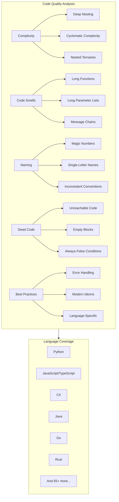

# Code Quality Rules

UAST-Grep provides **952 code quality rules** for **20+ languages** plus universal rules that work across all 71 supported languages. These rules detect code smells, complexity issues, naming violations, dead code, and anti-patterns.

> **See Also:** [Rules Catalog](rules-catalog.md) for the complete rule index | [CWE & OWASP Coverage](cwe-owasp-coverage.md) for security coverage



## Features

| Feature | Description |
|---------|-------------|
| **Universal Detection** | Same rules work across all supported languages |
| **Configurable Thresholds** | Adjust severity and limits to match your standards |
| **Refactoring Suggestions** | Each rule includes actionable fix recommendations |
| **CI/CD Ready** | Easy integration with build pipelines |
| **Research-Backed** | Thresholds based on industry research and best practices |

## Quick Start

```bash
# Scan for all quality issues
uast-grep scan -r rules/universal-quality.yaml ./src

# Scan specific categories
uast-grep scan -r rules/universal-quality.yaml --tags complexity ./src
uast-grep scan -r rules/universal-quality.yaml --tags smell ./src
uast-grep scan -r rules/universal-quality.yaml --tags naming ./src

# Scan specific language files
uast-grep scan -r rules/universal-quality.yaml --lang python ./src
uast-grep scan -r rules/universal-quality.yaml --lang javascript ./src
```

## Rule Categories

### Complexity Rules

Rules that detect overly complex code structures that hurt readability and maintainability.

| Rule ID | Severity | Description |
|---------|----------|-------------|
| `universal-deep-nesting` | warning | Deep nesting (4+ levels) - arrow anti-pattern |
| `universal-triple-nested-loop` | warning | Triple nested loops - O(n^3) complexity |
| `universal-nested-ternary` | error | Nested ternary operators |
| `universal-long-condition-chain` | warning | Long if/else-if chains (6+ branches) |
| `universal-complex-boolean` | warning | Complex boolean expressions (4+ operators) |

#### Deep Nesting Example

```javascript
// BAD: Arrow anti-pattern (4+ levels of nesting)
function processOrder(order) {
    if (order !== null) {
        if (order.isValid()) {
            if (order.isPaid()) {
                if (!order.isCancelled()) {
                    shipOrder(order);  // Too deep!
                }
            }
        }
    }
}

// GOOD: Guard clauses flatten the code
function processOrder(order) {
    if (order === null) return;
    if (!order.isValid()) return;
    if (!order.isPaid()) return;
    if (order.isCancelled()) return;

    shipOrder(order);  // Clear and flat
}
```

#### Nested Ternary Example

```javascript
// BAD: Nested ternary (hard to read)
const result = a ? (b ? 'AB' : (c ? 'AC' : 'A')) : (d ? 'D' : 'none');

// GOOD: Use if/else or early returns
let result;
if (a) {
    result = b ? 'AB' : (c ? 'AC' : 'A');
} else {
    result = d ? 'D' : 'none';
}
```

### Code Smell Rules

Rules that detect Martin Fowler's classic code smells and modern anti-patterns.

| Rule ID | Severity | Description |
|---------|----------|-------------|
| `universal-long-parameter-list` | warning | Functions with 6+ parameters |
| `universal-message-chain` | warning | Long method chains (5+ calls) |
| `universal-empty-function` | warning | Empty function bodies |
| `universal-empty-catch` | error | Empty catch blocks that swallow exceptions |
| `universal-catch-generic-exception` | warning | Catching overly broad exceptions |

#### Long Parameter List Example

```java
// BAD: Too many parameters
public void createUser(String firstName, String lastName,
                      String email, String phone,
                      String street, String city,
                      String state, String zip) {
    // ...
}

// GOOD: Use a parameter object
public void createUser(UserDetails details) {
    // ...
}

// Or use builder pattern
User user = User.builder()
    .name("John", "Doe")
    .email("john@example.com")
    .address(address)
    .build();
```

#### Message Chain Example

```javascript
// BAD: Long method chain (Law of Demeter violation)
const city = order.getCustomer().getAddress().getCity().getName();

// GOOD: Ask for what you need directly
const city = order.getDeliveryCity();
```

### Naming Rules

Rules that enforce clear, consistent naming practices.

| Rule ID | Severity | Description |
|---------|----------|-------------|
| `universal-magic-number` | warning | Unexplained numeric literals |
| `universal-magic-string` | warning | Unexplained string literals in comparisons |
| `universal-single-letter-variable` | info | Single-letter names outside loop context |
| `universal-numbered-suffix` | info | Variables like var1, var2, var3 |
| `universal-hungarian-notation` | info | Type prefixes like strName, iCount |

#### Magic Number Example

```python
# BAD: Magic numbers
if age >= 18:
    if duration > 86400:
        if score < 0.7:
            fail()

# GOOD: Named constants explain meaning
MINIMUM_ADULT_AGE = 18
SECONDS_PER_DAY = 86400
PASSING_THRESHOLD = 0.7

if age >= MINIMUM_ADULT_AGE:
    if duration > SECONDS_PER_DAY:
        if score < PASSING_THRESHOLD:
            fail()
```

### Dead Code Rules

Rules that detect code that is never executed or has no effect.

| Rule ID | Severity | Description |
|---------|----------|-------------|
| `universal-code-after-return` | error | Unreachable code after return |
| `universal-code-after-throw` | error | Unreachable code after throw |
| `universal-if-false` | warning | Condition always false |
| `universal-if-true` | info | Condition always true |
| `universal-empty-if` | warning | Empty if block |
| `universal-empty-loop` | warning | Empty loop body |
| `universal-self-assignment` | warning | Assigning variable to itself |

#### Unreachable Code Example

```javascript
// BAD: Code after return is dead
function calculate(x) {
    if (x < 0) {
        return -1;
        console.log("Negative input");  // Never executed!
    }
    return x * 2;
}

// GOOD: Log before returning
function calculate(x) {
    if (x < 0) {
        console.log("Negative input");
        return -1;
    }
    return x * 2;
}
```

### Technical Debt Markers

Rules that detect TODO, FIXME, and other markers requiring attention.

| Rule ID | Severity | Description |
|---------|----------|-------------|
| `universal-todo-comment` | info | TODO comments to track |
| `universal-fixme-comment` | warning | FIXME comments indicating bugs |
| `universal-hack-comment` | warning | HACK comments indicating workarounds |
| `universal-xxx-comment` | warning | XXX markers for problematic code |

### Best Practice Rules

Rules that enforce modern coding practices and common patterns.

| Rule ID | Severity | Description |
|---------|----------|-------------|
| `universal-negated-condition` | info | Negated condition with else block |
| `universal-yoda-condition` | info | Constant on left side of comparison |
| `universal-double-negation` | info | !! for boolean conversion |
| `universal-assignment-in-condition` | warning | Assignment in if/while condition |
| `universal-equality-with-nan` | error | Comparing with NaN directly |

## Language-Specific Rules

In addition to universal rules, UAST-Grep includes language-specific quality rules that enforce idioms and best practices for each language.

### Python

| Rule ID | Severity | Description |
|---------|----------|-------------|
| `universal-python-except-pass` | warning | Empty except blocks |
| `universal-python-bare-except` | warning | Catching all exceptions |
| `universal-python-mutable-default` | error | Mutable default arguments |
| `universal-python-equality-none` | warning | Using == None instead of is None |
| `universal-python-equality-bool` | info | Comparing to True/False |

```python
# BAD: Mutable default argument
def add_item(item, items=[]):
    items.append(item)
    return items

# GOOD: Use None as sentinel
def add_item(item, items=None):
    if items is None:
        items = []
    items.append(item)
    return items
```

### JavaScript/TypeScript

| Rule ID | Severity | Description |
|---------|----------|-------------|
| `universal-js-var-declaration` | warning | Using var instead of const/let |
| `universal-js-triple-equals` | warning | Using == instead of === |
| `universal-js-array-callback-return` | warning | Missing return in map/filter/reduce |
| `universal-ts-any-type` | warning | Using any type in TypeScript |

```typescript
// BAD: Using any defeats TypeScript's purpose
function process(data: any): any {
    return data.value;
}

// GOOD: Use specific types or unknown
function process(data: UserData): ProcessedData {
    return { value: data.value };
}

// GOOD: Use unknown for truly unknown types
function parseJson(json: string): unknown {
    return JSON.parse(json);
}
```

### C#

| Rule ID | Severity | Description |
|---------|----------|-------------|
| `universal-csharp-async-void` | error | async void methods (except event handlers) |
| `universal-csharp-sync-over-async` | error | Blocking on .Result/.Wait() |
| `universal-csharp-string-concat-loop` | warning | String += in loops |

```csharp
// BAD: async void can't be awaited
public async void ProcessData() {
    await DoWork();
}

// GOOD: async Task can be awaited and exceptions handled
public async Task ProcessDataAsync() {
    await DoWork();
}

// BAD: Blocking on async causes deadlocks
public string GetData() {
    return GetDataAsync().Result;  // Deadlock risk!
}

// GOOD: Async all the way
public async Task<string> GetDataAsync() {
    return await FetchDataAsync();
}
```

### Go

| Rule ID | Severity | Description |
|---------|----------|-------------|
| `universal-go-error-ignored` | error | Ignoring error return values |
| `universal-go-naked-return` | info | Naked returns in long functions |

```go
// BAD: Ignoring error
data := ReadFile("config.json")

// GOOD: Handle errors explicitly
data, err := ReadFile("config.json")
if err != nil {
    return fmt.Errorf("failed to read config: %w", err)
}

// GOOD: Explicitly ignore if intentional
_, _ = WriteLogs(message)
```

### Rust

| Rule ID | Severity | Description |
|---------|----------|-------------|
| `universal-rust-unwrap` | warning | Using .unwrap() without expect() |
| `universal-rust-clone-instead-borrow` | info | Cloning when borrowing would work |

```rust
// BAD: unwrap() panics without explanation
let value = some_option.unwrap();

// GOOD: expect() explains what went wrong
let value = some_option.expect("configuration must be present");

// BETTER: Handle the None case properly
let value = match some_option {
    Some(v) => v,
    None => return Err(ConfigError::Missing),
};

// BEST: Use ? operator for propagation
let value = some_option.ok_or(ConfigError::Missing)?;
```

### Java

| Rule ID | Severity | Description |
|---------|----------|-------------|
| `universal-java-equals-on-null` | error | Potential NPE with .equals() |
| `universal-java-string-concat-loop` | warning | String concatenation in loops |
| `universal-java-raw-type` | warning | Using raw generic types |

```java
// BAD: NPE if name is null
if (name.equals(otherName)) { ... }

// GOOD: Use Objects.equals()
if (Objects.equals(name, otherName)) { ... }

// GOOD: Put literal first if comparing to constant
if ("expected".equals(name)) { ... }
```

## CI/CD Integration

### GitHub Actions

```yaml
name: Code Quality
on: [push, pull_request]

jobs:
  quality:
    runs-on: ubuntu-latest
    steps:
      - uses: actions/checkout@v4

      - name: Install UAST-Grep
        run: |
          # Installation steps here

      - name: Check Code Quality
        run: |
          uast-grep scan -r rules/universal-quality.yaml \
            --output-format sarif \
            --output quality-results.sarif \
            ./src

      - name: Upload SARIF results
        uses: github/codeql-action/upload-sarif@v2
        with:
          sarif_file: quality-results.sarif
```

### GitLab CI

```yaml
quality:
  stage: test
  script:
    - uast-grep scan -r rules/universal-quality.yaml --output-format json ./src > quality.json
  artifacts:
    reports:
      codequality: quality.json
```

### Pre-commit Hook

```yaml
# .pre-commit-config.yaml
repos:
  - repo: local
    hooks:
      - id: uast-grep-quality
        name: Code Quality Check
        entry: uast-grep scan -r rules/universal-quality.yaml
        language: system
        types: [file]
        exclude: ^(vendor|node_modules)/
```

## Configuration

### Adjusting Thresholds

Create a custom configuration to adjust thresholds for your project:

```yaml
# .uast-grep/quality-config.yaml
extends: rules/universal-quality.yaml

overrides:
  # Allow deeper nesting in legacy code
  - id: universal-deep-nesting
    severity: info

  # Stricter on magic numbers
  - id: universal-magic-number
    severity: error

  # Disable Hungarian notation check
  - id: universal-hungarian-notation
    enabled: false
```

### Excluding Patterns

```yaml
# Exclude specific files or patterns
exclude:
  - "**/*.test.js"
  - "**/*.spec.ts"
  - "**/migrations/*"
  - "**/generated/*"
```

## Threshold Guidelines

The thresholds used in these rules are based on industry research:

| Metric | Warning | Error | Source |
|--------|---------|-------|--------|
| Nesting Depth | 4 | 6 | Polyspace, SonarQube |
| Cyclomatic Complexity | 10 | 20 | NIST SP 500-235 |
| Cognitive Complexity | 10 | 15 | SonarSource |
| Parameters | 5 | 7 | Clean Code, PMD |
| Method Chain Length | 4 | 6 | Law of Demeter |
| Switch Cases | 10 | 20 | Refactoring (Fowler) |

## Limitations

1. **Cross-file Analysis**: Some code smells like "Duplicate Code" and "Feature Envy" require analysis across multiple files, which may not be available in all modes.

2. **Dynamic Languages**: In dynamically-typed languages (Python, JavaScript), some type-based rules have reduced accuracy.

3. **False Positives**: Some patterns like magic numbers may flag legitimate uses. Use configuration to adjust for your codebase.

4. **Framework Idioms**: Some frameworks have idioms that may trigger rules (e.g., Django's `objects.filter().values().annotate()` chains). Consider excluding framework code or adjusting thresholds.

## Related Rules

- [Security Rules](./security.md) - Vulnerability detection
- [Performance Rules](./performance.md) - Performance anti-patterns
- [Custom Rules](../custom-rules.md) - Creating your own quality rules

## References

- Fowler, M. (2018). *Refactoring: Improving the Design of Existing Code*
- Martin, R.C. (2008). *Clean Code: A Handbook of Agile Software Craftsmanship*
- McCabe, T.J. (1976). "A Complexity Measure" - IEEE Transactions on Software Engineering
- SonarSource. "Cognitive Complexity" whitepaper
- NIST SP 500-235. "Structured Testing: A Testing Methodology Using the Cyclomatic Complexity Metric"
