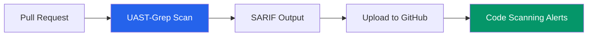

# Security Rules

Pre-built security rules with **1,587 rules** covering **179 CWE identifiers** across **31 languages** plus universal rules that work on all 71 supported languages.

> **See Also:** [Rules Catalog](rules-catalog.md) for the complete rule index | [CWE & OWASP Coverage](cwe-owasp-coverage.md) for compliance mapping

## Security Scanning Overview

UAST-Grep is designed from the ground up as a **security scanning tool**. Unlike regex-based tools, AST-based scanning understands code structure, reducing false positives and catching complex patterns.

```mermaid
flowchart LR
    subgraph Languages["Supported Languages"]
        PY["Python"]
        JS["JavaScript"]
        PS["PowerShell"]
        RS["Rust"]
        CS["C#"]
        GO["Go"]
        More["...66 more"]
    end

    subgraph Scanner["UAST-Grep Scanner"]
        Rules["YAML Rules"]
        UAST["UAST Layer"]
        Match["Pattern Matcher"]
    end

    subgraph Output
        TEXT["Text Report"]
        SARIF["SARIF 2.1.0"]
        JSON["JSON"]
    end

    Languages --> Scanner
    Scanner --> Output

    style SARIF fill:#059669,color:#fff
    style Rules fill:#2563eb,color:#fff
```



### Key Security Features

| Feature | Description |
|---------|-------------|
| **Cross-language rules** | One rule works across all 71 languages |
| **Universal rules** | Use `language: "*"` for polyglot codebases |
| **SARIF output** | Native CI/CD integration |
| **Severity levels** | error, warning, info, hint |
| **Auto-fix** | Automatically remediate issues |
| **CWE tagging** | Map findings to CWE identifiers |

## Cross-Language Security Scanning

One of UAST-Grep's most powerful features is **universal rules** that work across all languages. This is ideal for security teams scanning polyglot codebases.

### Universal Rules (language: "*")

```yaml
# This single rule finds dangerous code execution across ALL languages
id: universal-code-execution
language: "*"  # Matches Python, JavaScript, PowerShell, C#, Java, etc.
severity: error
message: "Potential code execution vulnerability detected"
tags: [security, injection, CWE-94]

rule:
  kind: CallExpression
  has:
    any:
      - pattern: "eval"
      - pattern: "exec"
      - pattern: "compile"
      - pattern: "Invoke-Expression"
      - pattern: "Function"
      - pattern: "setTimeout"
      - pattern: "setInterval"
```

### Language-Agnostic Patterns

Because UAST normalizes AST node types, you can write patterns that automatically work across languages:

| UAST Pattern | Python | JavaScript | PowerShell | C# |
|--------------|--------|------------|------------|-----|
| `FunctionDeclaration` | `function_definition` | `function_declaration` | `function_statement` | `method_declaration` |
| `CallExpression` | `call` | `call_expression` | `command` | `invocation_expression` |
| `TryStatement` | `try_statement` | `try_statement` | `try_statement` | `try_statement` |
| `StringLiteral` | `string` | `string` | `expandable_string_literal` | `string_literal` |

### Example: Cross-Language Hardcoded Secrets

```yaml
id: universal-hardcoded-secrets
language: "*"
severity: error
message: "Hardcoded credential detected: $VAR"
tags: [security, credentials, CWE-798]

rule:
  pattern: "§VAR = §VALUE"

constraints:
  VAR:
    regex: "(?i)(password|passwd|secret|api_key|apikey|token|auth_token|bearer|private_key)"
  VALUE:
    kind: StringLiteral
    regex: ".{8,}"  # At least 8 characters (not empty)
```

This single rule catches:
- Python: `password = "secret123"`
- JavaScript: `const apiKey = "sk-abc123"`
- PowerShell: `$SecretKey = "mysecret"`
- C#: `string password = "hunter2"`
- Go: `password := "secret"`

## Injection Vulnerabilities

### Command Injection

```yaml
id: command-injection-python
language: python
severity: error
message: "Possible command injection vulnerability"
tags: [security, injection, CWE-78]

rule:
  any:
    - pattern: "os.system(§INPUT)"
    - pattern: "os.popen(§INPUT)"
    - pattern: "subprocess.call(§INPUT, shell=True)"
    - pattern: "subprocess.run(§INPUT, shell=True)"
    - pattern: "subprocess.Popen(§INPUT, shell=True)"
```

```yaml
id: command-injection-powershell
language: powershell
severity: error
message: "Possible command injection via Invoke-Expression"
tags: [security, injection, CWE-78]

rule:
  any:
    - pattern: "Invoke-Expression §§§ARGS"
    - pattern: "iex §§§ARGS"
    - pattern: "& §DYNAMIC"
```

### SQL Injection

```yaml
id: sql-injection
language: python
severity: error
message: "Possible SQL injection - use parameterized queries"
tags: [security, injection, CWE-89]

rule:
  any:
    - pattern: 'cursor.execute(§QUERY + §INPUT)'
    - pattern: 'cursor.execute(§QUERY % §INPUT)'
    - pattern: 'cursor.execute(f"§§§SQL")'
    - pattern: 'cursor.execute(§QUERY.format(§§§ARGS))'
    - pattern: 'engine.execute(§QUERY + §INPUT)'
    - pattern: 'connection.execute(§QUERY + §INPUT)'

fix: "Use parameterized queries: cursor.execute(query, params)"
```

### XSS (Cross-Site Scripting)

```yaml
id: xss-innerHTML
language: javascript
severity: error
message: "Possible XSS via innerHTML"
tags: [security, xss, CWE-79]

rule:
  any:
    - pattern: "§ELEMENT.innerHTML = §INPUT"
    - pattern: "document.write(§INPUT)"
    - pattern: "document.writeln(§INPUT)"
```

### Path Traversal

```yaml
id: path-traversal
language: python
severity: error
message: "Possible path traversal vulnerability"
tags: [security, path-traversal, CWE-22]

rule:
  any:
    - pattern: "open(§INPUT)"
    - pattern: "open(§INPUT, §MODE)"
    - pattern: "os.path.join(§BASE, §INPUT)"
  not:
    has:
      pattern: "os.path.realpath"
```

### Code Injection

```yaml
id: code-injection-python
language: python
severity: error
message: "eval()/exec() with dynamic input enables code injection"
tags: [security, injection, CWE-94]

rule:
  any:
    - pattern: "eval(§INPUT)"
    - pattern: "exec(§INPUT)"
    - pattern: "compile(§INPUT, §§§REST)"

fix: "Use ast.literal_eval() for safe evaluation of literals"
```

## Authentication & Authorization

### Hardcoded Credentials

```yaml
id: hardcoded-credentials
language: python
severity: error
message: "Hardcoded credentials detected"
tags: [security, credentials, CWE-798]

rule:
  pattern: "§VAR = §VALUE"

constraints:
  VAR:
    regex: "(?i)(password|passwd|pwd|secret|api_key|apikey|token|auth)"
  VALUE:
    kind: string

examples:
  match:
    - 'password = "secret123"'
    - 'API_KEY = "sk-abc123"'
  no-match:
    - 'password = os.environ["PASSWORD"]'
```

```yaml
id: hardcoded-credentials-js
language: javascript
severity: error
message: "Hardcoded credentials detected"
tags: [security, credentials, CWE-798]

rule:
  any:
    - pattern: 'const §VAR = "§VALUE"'
    - pattern: 'let §VAR = "§VALUE"'
    - pattern: 'var §VAR = "§VALUE"'

constraints:
  VAR:
    regex: "(?i)(password|secret|apiKey|token|auth)"
```

### Weak Password Requirements

```yaml
id: weak-password-length
language: python
severity: warning
message: "Password length requirement may be too short"
tags: [security, authentication, CWE-521]

rule:
  pattern: 'len(§PASSWORD) >= §LENGTH'

constraints:
  LENGTH:
    regex: "^[0-7]$"  # Less than 8
```

## Cryptography

### Weak Hashing

```yaml
id: weak-hash-python
language: python
severity: error
message: "MD5/SHA1 are cryptographically broken"
tags: [security, crypto, CWE-328]

rule:
  any:
    - pattern: "hashlib.md5(§§§ARGS)"
    - pattern: "hashlib.sha1(§§§ARGS)"
    - pattern: "MD5.new(§§§ARGS)"
    - pattern: "SHA.new(§§§ARGS)"

fix: "Use SHA-256 or stronger: hashlib.sha256()"
```

### Insecure Random

```yaml
id: insecure-random
language: python
severity: warning
message: "random module is not cryptographically secure"
tags: [security, crypto, CWE-338]

rule:
  any:
    - pattern: "random.random()"
    - pattern: "random.randint(§§§ARGS)"
    - pattern: "random.choice(§§§ARGS)"
    - pattern: "random.sample(§§§ARGS)"
  inside:
    any:
      - pattern: "§VAR = §FUNC"
        constraints:
          VAR:
            regex: "(?i)(token|key|secret|password|salt|nonce)"
      - kind: function_definition
        has:
          regex: "(?i)(auth|login|password|token|key|secret)"

fix: "Use secrets module: secrets.token_hex(), secrets.randbelow()"
```

### Hardcoded Secrets

```yaml
id: hardcoded-key
language: python
severity: error
message: "Hardcoded cryptographic key"
tags: [security, crypto, CWE-321]

rule:
  any:
    - pattern: 'Fernet(b"§KEY")'
    - pattern: 'AES.new(b"§KEY", §§§REST)'
    - pattern: '§VAR.encrypt(§DATA, key=b"§KEY")'
```

## Deserialization

### Insecure Deserialization

```yaml
id: insecure-pickle
language: python
severity: error
message: "pickle can execute arbitrary code during deserialization"
tags: [security, deserialization, CWE-502]

rule:
  any:
    - pattern: "pickle.load(§INPUT)"
    - pattern: "pickle.loads(§INPUT)"
    - pattern: "cPickle.load(§INPUT)"
    - pattern: "cPickle.loads(§INPUT)"
```

```yaml
id: insecure-yaml-load
language: python
severity: error
message: "yaml.load() can execute arbitrary code"
tags: [security, deserialization, CWE-502]

rule:
  pattern: "yaml.load(§INPUT)"
  not:
    has:
      pattern: "Loader=yaml.SafeLoader"

fix: "Use yaml.safe_load() instead"
```

## Network Security

### Disabled SSL Verification

```yaml
id: disabled-ssl-verify
language: python
severity: error
message: "SSL verification is disabled"
tags: [security, network, CWE-295]

rule:
  any:
    - pattern: "requests.get(§URL, verify=False)"
    - pattern: "requests.post(§URL, §§§ARGS, verify=False)"
    - pattern: "urllib3.disable_warnings()"
```

### Unvalidated Redirect

```yaml
id: open-redirect
language: python
severity: warning
message: "Possible open redirect vulnerability"
tags: [security, redirect, CWE-601]

rule:
  any:
    - pattern: "redirect(§INPUT)"
    - pattern: "HttpResponseRedirect(§INPUT)"
  not:
    has:
      any:
        - pattern: "url_has_allowed_host_and_scheme"
        - pattern: "is_safe_url"
```

## Information Disclosure

### Debug Mode in Production

```yaml
id: debug-mode
language: python
severity: warning
message: "Debug mode should be disabled in production"
tags: [security, info-disclosure, CWE-215]

rule:
  any:
    - pattern: "DEBUG = True"
    - pattern: "app.run(debug=True)"
    - pattern: "app.config['DEBUG'] = True"
```

### Sensitive Data Logging

```yaml
id: password-logging
language: python
severity: error
message: "Potential password/secret in log output"
tags: [security, logging, CWE-532]

rule:
  any:
    - pattern: "logging.§LEVEL(§MSG)"
    - pattern: "logger.§LEVEL(§MSG)"
    - pattern: "print(§MSG)"

constraints:
  MSG:
    regex: "(?i)(password|secret|token|key|credential)"
```

## Pre-Built Universal Rules

UAST-Grep includes a **universal security rules file** that works across all 71 languages:

```bash
# Scan with universal cross-language rules
uast-grep scan -r rules/universal-security.yaml ./src
```

### Available Universal Rules

#### Injection Vulnerabilities

| Rule ID | CWE | Description |
|---------|-----|-------------|
| `universal-dangerous-code-execution` | CWE-94 | Dynamic code execution (eval, exec, loadstring, etc.) across 40+ languages |
| `universal-command-execution` | CWE-78 | System command execution (os.system, exec.Command, ProcessBuilder, etc.) |
| `universal-sql-string-concat` | CWE-89 | SQL string concatenation patterns |
| `universal-sql-format-string` | CWE-89 | SQL with string interpolation |
| `universal-ldap-injection` | CWE-90 | Dynamic LDAP filter construction |
| `universal-template-injection` | CWE-1336 | Server-side template injection (SSTI) |
| `universal-log-injection` | CWE-117 | Unsanitized input in log output |

#### Credentials & Secrets

| Rule ID | CWE | Description |
|---------|-----|-------------|
| `universal-hardcoded-password` | CWE-798 | Hardcoded passwords in assignments |
| `universal-hardcoded-secret-variable` | CWE-798 | Secret variable assignments |
| `universal-secret-patterns` | CWE-798 | AWS keys, JWT tokens, GitHub tokens, Slack tokens, private keys |
| `universal-env-exposure` | CWE-200 | Sensitive environment variable access |

#### Cryptography

| Rule ID | CWE | Description |
|---------|-----|-------------|
| `universal-weak-hash` | CWE-328 | MD5/SHA1 usage across all languages |
| `universal-weak-cipher` | CWE-327 | DES, 3DES, RC4, RC2, Blowfish, ECB mode |
| `universal-insecure-random` | CWE-330/338 | Non-cryptographic random (Math.random, random.random, etc.) |

#### Network Security

| Rule ID | CWE | Description |
|---------|-----|-------------|
| `universal-ssl-verify-disabled` | CWE-295 | SSL certificate verification disabled |
| `universal-ssrf-http-request` | CWE-918 | HTTP requests with dynamic URLs (SSRF) |
| `universal-insecure-http` | CWE-319 | Plaintext HTTP URLs (non-localhost) |

#### Data Processing

| Rule ID | CWE | Description |
|---------|-----|-------------|
| `universal-insecure-deserialization` | CWE-502 | pickle, Marshal, ObjectInputStream, BinaryFormatter, binary_to_term |
| `universal-xxe-xml-parsing` | CWE-611 | XML parsing without disabling external entities |
| `universal-path-traversal` | CWE-22 | File operations with dynamic paths |
| `universal-path-traversal-pattern` | CWE-22 | Path traversal patterns in strings |

#### XSS & Output

| Rule ID | CWE | Description |
|---------|-----|-------------|
| `universal-dangerous-html` | CWE-79 | innerHTML, document.write, dangerouslySetInnerHTML, v-html |
| `universal-xss-unsafe-functions` | CWE-79 | mark_safe, html_safe, raw, preEscapedToHtml |
| `universal-open-redirect` | CWE-601 | User-controlled redirect URLs |

#### Memory & Safety

| Rule ID | CWE | Description |
|---------|-----|-------------|
| `universal-memory-unsafe-c` | CWE-119/120 | strcpy, strcat, sprintf, gets, unsafe blocks |
| `universal-format-string` | CWE-134 | Format string vulnerabilities |
| `universal-haskell-unsafe` | CWE-676 | unsafePerformIO, unsafeCoerce |

#### Authentication & Session

| Rule ID | CWE | Description |
|---------|-----|-------------|
| `universal-jwt-weak-verification` | CWE-347 | JWT "none" algorithm, disabled verification |
| `universal-weak-password-check` | CWE-521 | Password length < 8 characters |
| `universal-insecure-cookie` | CWE-614/1004 | Cookies without Secure/HttpOnly/SameSite |
| `universal-mass-assignment` | CWE-915 | Object property injection |

#### Error Handling & Logging

| Rule ID | CWE | Description |
|---------|-----|-------------|
| `universal-empty-catch` | CWE-390 | Empty exception handlers |
| `universal-stack-trace-exposure` | CWE-209 | Stack traces exposed to users |
| `universal-debug-enabled` | CWE-215 | Debug mode enabled |
| `universal-sensitive-logging` | CWE-532 | Secrets in log output |

#### Denial of Service

| Rule ID | CWE | Description |
|---------|-----|-------------|
| `universal-unbounded-loop` | CWE-400/835 | Infinite loops |
| `universal-atom-exhaustion` | CWE-400 | Erlang/Elixir atom table exhaustion |
| `universal-redos-dangerous-regex` | CWE-1333 | Regex denial of service patterns |

#### Resource Management

| Rule ID | CWE | Description |
|---------|-----|-------------|
| `universal-resource-leak` | CWE-404 | Unclosed files/connections |
| `universal-toctou-race` | CWE-367 | Time-of-check time-of-use race conditions |

#### Language-Specific Dangerous Patterns

| Rule ID | CWE | Description |
|---------|-----|-------------|
| `universal-prototype-pollution` | CWE-1321 | JavaScript __proto__, Python __class__ |
| `universal-lua-debug-library` | CWE-489 | Lua debug library in production |

### Using Pre-Built Rules

```bash
# Use universal rules (works for ANY language)
uast-grep scan -r rules/universal-security.yaml ./src

# Combine with language-specific rules
uast-grep scan -r rules/universal-security.yaml -r rules/python.yaml ./src

# All rules together
uast-grep scan -r rules/ ./src
```

## Using Security Rules

### Quick Scan

```bash
# Run scan with all rules
uast-grep scan -r rules/ ./src

# Scan with SARIF output for CI/CD
uast-grep scan -r rules/security/ -f sarif ./src > results.sarif

# Fail CI on errors
uast-grep scan -r rules/security/ --fail-on-issues ./src
```

### CI/CD Integration



#### GitHub Actions

```yaml
name: Security Scan

on: [push, pull_request]

jobs:
  security:
    runs-on: ubuntu-latest
    steps:
      - uses: actions/checkout@v4

      - name: Download UAST-Grep
        run: |
          curl -LO https://github.com/Variably-Constant/UAST-Grep/releases/latest/download/uast-grep-linux-x64.tar.gz
          tar -xzf uast-grep-linux-x64.tar.gz

      - name: Security Scan
        run: ./uast-grep scan -r rules/security/ -f sarif ./src > security.sarif

      - name: Upload SARIF
        uses: github/codeql-action/upload-sarif@v2
        with:
          sarif_file: security.sarif
```

#### GitLab CI

```yaml
security-scan:
  stage: test
  script:
    - curl -LO https://github.com/Variably-Constant/UAST-Grep/releases/latest/download/uast-grep-linux-x64.tar.gz
    - tar -xzf uast-grep-linux-x64.tar.gz
    - ./uast-grep scan -r rules/security/ -f sarif ./src > gl-sast-report.json
  artifacts:
    reports:
      sast: gl-sast-report.json
```

### Custom Rules

Extend the built-in rules for your organization:

```yaml
# rules/custom/my-security.yaml
id: my-company-auth-check
language: python
severity: error
message: "Use company auth library"
tags: [security, custom]

rule:
  pattern: "jwt.decode(§§§ARGS)"
  not:
    inside:
      pattern: "from mycompany.auth import §§§"

fix: "Use mycompany.auth.verify_token() instead"
```

## Rule Categories

| Category | CWE Coverage | Description |
|----------|--------------|-------------|
| **Injection** | CWE-78, CWE-89, CWE-90, CWE-94, CWE-117, CWE-1336 | Command, SQL, LDAP, code, log, template injection |
| **XSS** | CWE-79 | Cross-site scripting, unsafe HTML output |
| **Credentials** | CWE-798, CWE-200 | Hardcoded passwords/secrets, env exposure |
| **Crypto** | CWE-327, CWE-328, CWE-330, CWE-338 | Weak hashing, weak ciphers, insecure random |
| **Deserialization** | CWE-502 | pickle, YAML, Marshal, BinaryFormatter, binary_to_term |
| **Network** | CWE-295, CWE-319, CWE-918 | SSL bypass, plaintext HTTP, SSRF |
| **Path Traversal** | CWE-22 | Directory traversal, file operations |
| **XML** | CWE-611 | XXE (XML External Entity) injection |
| **Info Disclosure** | CWE-209, CWE-215, CWE-532 | Stack traces, debug mode, sensitive logging |
| **Authentication** | CWE-347, CWE-521, CWE-601, CWE-614 | JWT issues, weak passwords, redirects, cookies |
| **Memory Safety** | CWE-119, CWE-120, CWE-134, CWE-676 | Buffer overflow, format string, unsafe functions |
| **DoS** | CWE-400, CWE-835, CWE-1333 | Infinite loops, atom exhaustion, ReDoS |
| **Resources** | CWE-367, CWE-390, CWE-404 | TOCTOU, empty catch, resource leaks |
| **Object Injection** | CWE-915, CWE-1321 | Mass assignment, prototype pollution |

## Limitations

UAST-Grep excels at **pattern-based security scanning** but has limitations compared to advanced security analysis tools:

### What UAST-Grep Can Do

| Capability | Status | Example |
|------------|--------|---------|
| Pattern matching | Excellent | Find `eval()`, `Invoke-Expression`, etc. |
| Cross-language rules | Excellent | One rule works for 71 languages |
| Structural matching | Good | Match specific AST node types |
| Constraint-based filtering | Good | Regex, kind, inside/has constraints |
| SARIF output | Excellent | CI/CD integration |
| Auto-fix | Good | Automated remediation |

### What UAST-Grep Cannot Do

| Limitation | Description | Example |
|------------|-------------|---------|
| **Taint Tracking** | Cannot track data flow from sources to sinks through variables | `input = request.get('cmd'); os.system(input)` - won't detect indirect flow |
| **Cross-file Analysis** | Rules only work within single files | Can't detect if dangerous function is called with user input from another file |
| **Interprocedural Analysis** | Cannot track data through function calls | `sanitize(user_input)` return value not tracked |
| **Control Flow Analysis** | Cannot determine if code is reachable | Won't know if dangerous code is behind impossible condition |
| **Semantic Equivalence** | Cannot detect obfuscated patterns | `getattr(__builtins__, 'ev'+'al')` won't be caught |
| **Entropy-based Secrets** | No ML/entropy detection for secrets | Only regex patterns, not high-entropy string detection |
| **Dependency Scanning** | Cannot check imported packages | Won't detect vulnerable npm/pip packages |

### Example: Indirect Data Flow (NOT Detected)

```python
# This pattern is NOT detected by UAST-Grep:
user_input = request.args.get('cmd')  # Taint source
processed = preprocess(user_input)     # Data flows through function
command = "ls " + processed            # String concatenation
os.system(command)                     # Dangerous sink

# Why? UAST-Grep doesn't track that 'command' came from user_input
```

### Complementary Tools

For comprehensive security coverage, consider using UAST-Grep alongside:

| Tool Type | Examples | Complements |
|-----------|----------|-------------|
| **Taint Analysis** | Semgrep Pro, CodeQL | Data flow tracking |
| **Dependency Scanning** | Snyk, Dependabot, pip-audit | Vulnerable packages |
| **Secret Scanning** | Gitleaks, TruffleHog | Entropy-based detection |
| **DAST** | OWASP ZAP, Burp Suite | Runtime testing |

### When to Use UAST-Grep

UAST-Grep is ideal for:
- **Fast pattern scanning** across large polyglot codebases
- **Pre-commit hooks** for quick security checks
- **Code style enforcement** with security rules
- **CI/CD gates** with SARIF integration
- **Custom rules** for organization-specific patterns
- **Cross-language consistency** with universal rules
