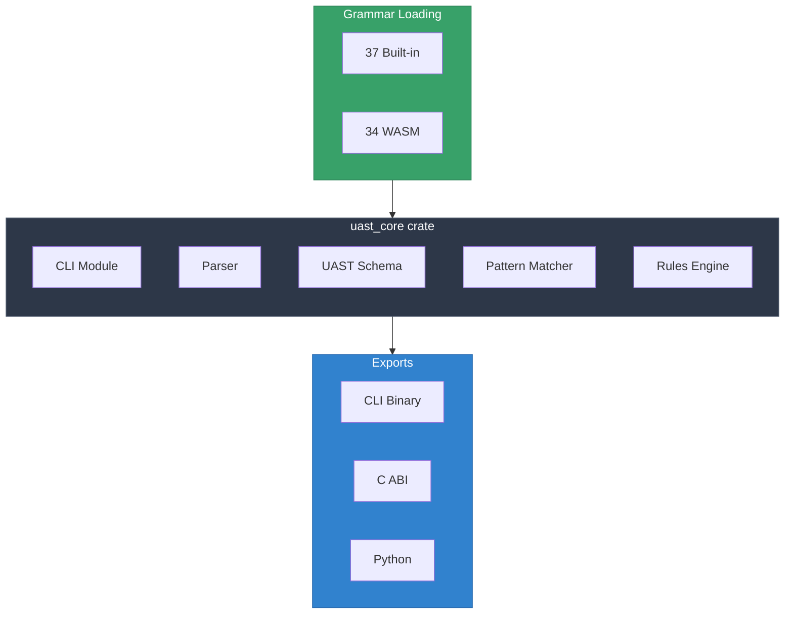

# UAST-Grep Native Rust Crate

> **High-performance tree-sitter parsing core with 71 language support**
>
> *Created by Mark Newton*

## Overview

The `uast_core` crate provides the core parsing, pattern matching, and rules engine for UAST-Grep. 37 built-in grammars are compiled directly into the binary, with 34 additional languages available via WASM loading.



## Project Structure

```
uast_core/
├── Cargo.toml              # tree-sitter 0.26, clap, pyo3
├── build.rs                # Compiles grammars via cc crate
├── src/
│   ├── lib.rs              # Library entry + FFI exports
│   ├── bin/main.rs         # CLI entry point
│   ├── cli/                # CLI commands
│   ├── builtin_languages.rs # 37 extern "C" declarations
│   ├── wasm_loader.rs      # WASM grammar loading
│   ├── uast/               # UAST schema and mappings
│   │   ├── schema.rs       # UastNode, UastKind
│   │   ├── mappings.rs     # Native->UAST REVERSE LOOKUP
│   │   └── mapper.rs       # Tree-to-UAST conversion
│   ├── matching/           # Pattern matching engine
│   ├── rules/              # YAML rules engine
│   ├── sarif/              # SARIF 2.1.0 output
│   └── python.rs           # PyO3 bindings
└── grammars/               # 37 built-in grammar sources
```

## UAST Reverse Mapping

The key feature enabling cross-language patterns:

```rust
// User writes PascalCase UAST pattern
uast-grep run -p FunctionDeclaration -l rust ./src

// System auto-translates to native types:
get_native_types_for_uast("FunctionDeclaration", "rust")   // ["function_item"]
get_native_types_for_uast("FunctionDeclaration", "python") // ["function_definition"]
```

## Build

```bash
cd native/uast_core
cargo build --release   # ~29MB binary, ~3 min (compiles 37 grammars)
cargo test              # Run tests
```

## Supported Languages (71)

### Built-in (37)

powershell, c-sharp, json, yaml, xml, toml, csv, dockerfile, hcl, bicep, nix, bash, html, css, javascript, typescript, tsx, vue, angular, markdown, python, go, java, c, cpp, rust, ruby, php, lua, cmake, make, proto, graphql, elixir, erlang, clojure, elm

### WASM (34)

verilog, latex, sql, fortran, fsharp, kotlin, cobol, scala, objc, julia, d, crystal, cuda, haskell, swift, perl, arduino, agda, ocaml, apex, dart, groovy, commonlisp, zig, awk, vim, r, bitbake, ada, cairo, dhall, cue, doxygen, comment

## License

MIT
